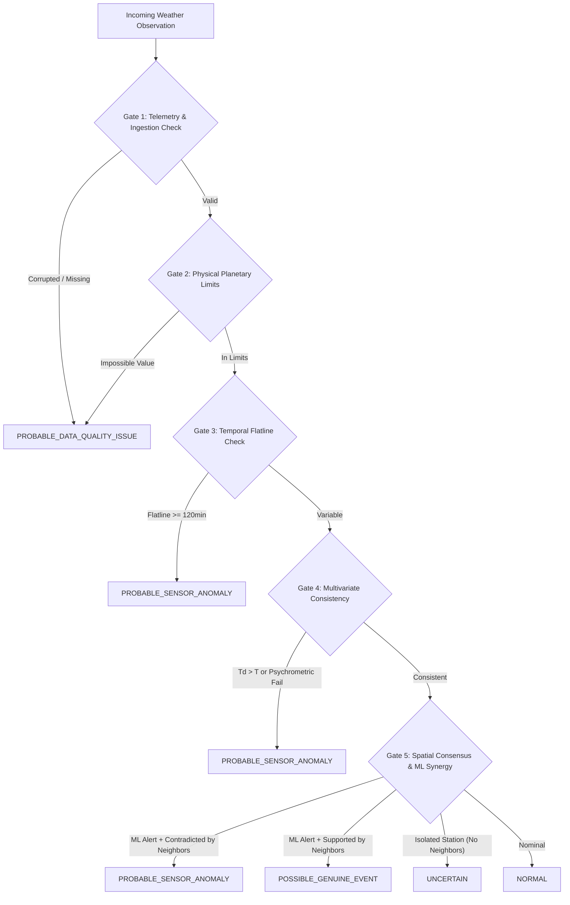
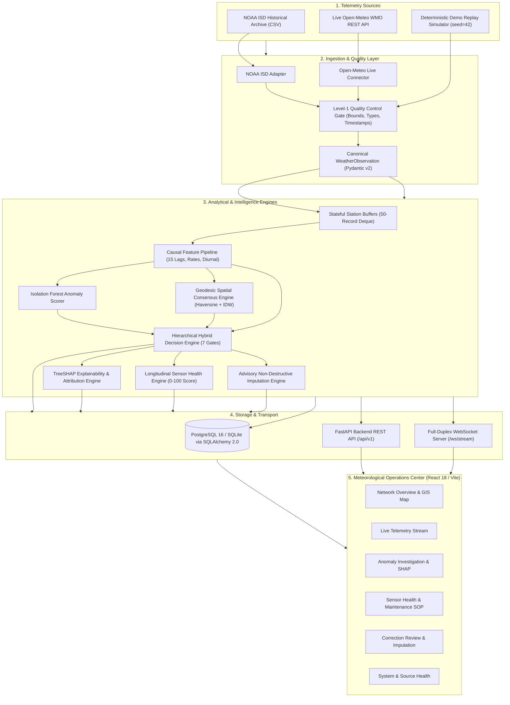

# SkyGuard AI

> **Real-Time Meteorological Anomaly Detection, Sensor Health & Operational Intelligence for Automatic Weather Stations (AWS)**

[](LICENSE)
[](pyproject.toml)
[](backend/)
[](frontend/)
[](alembic/)
[](docker-compose.yml)
[](tests/)
[](docs/HACKATHON_SUBMISSION_CHECKLIST.md)

**SkyGuard AI** is an enterprise-grade meteorological data quality, real-time anomaly detection, and sensor health platform engineered for Automatic Weather Station (AWS) surface networks. It solves the fundamental limitation of classical quality control by uniting physical meteorological laws, machine learning, and geodesic spatial consensus to detect hardware sensor degradation while strictly protecting genuine regional extreme weather events.

The platform provides end-to-end operational intelligence: from high-throughput asynchronous ingestion and non-destructive advisory imputation, to deterministic TreeSHAP feature attribution, longitudinal sensor health scoring (0–100), full-duplex WebSocket telemetry streaming, and a mission-control operations dashboard.

---

## Table of Contents

- [1. At a Glance](#1-at-a-glance)
- [2. The Problem](#2-the-problem)
- [3. The Solution](#3-the-solution)
- [4. Key Features](#4-key-features)
- [5. How SkyGuard Works — End-to-End](#5-how-skyguard-works--end-to-end)
- [6. System Architecture](#6-system-architecture)
- [7. Data Flow & Integrity Lifecycle](#7-data-flow--integrity-lifecycle)
- [8. Decision Logic & Evidence Synthesis](#8-decision-logic--evidence-synthesis)
- [9. Example Operational Scenarios](#9-example-operational-scenarios)
- [10. Operations Dashboard & UI](#10-operations-dashboard--ui)
- [11. Demonstration Presentation & Video](#11-demonstration-presentation--video)
- [12. Scientific & System-Wide Evaluation](#12-scientific--system-wide-evaluation)
- [13. Testing & Verification Suite](#13-testing--verification-suite)
- [14. Live Weather Source Qualification](#14-live-weather-source-qualification)
- [15. Meteorological Data Sources](#15-meteorological-data-sources)
- [16. Technology Stack](#16-technology-stack)
- [17. Repository Structure](#17-repository-structure)
- [18. Quick Start & Run Guide](#18-quick-start--run-guide)
- [19. Configuration & Environment](#19-configuration--environment)
- [20. REST API & WebSocket Reference](#20-rest-api--websocket-reference)
- [21. Security & Data Integrity Standards](#21-security--data-integrity-standards)
- [22. Disaster Recovery & Resilience](#22-disaster-recovery--resilience)
- [23. Benchmark Reproducibility](#23-benchmark-reproducibility)
- [24. System Limitations & Scope Boundaries](#24-system-limitations--scope-boundaries)
- [25. Project Roadmap](#25-project-roadmap)
- [26. Documentation Map](#26-documentation-map)
- [27. Contributing](#27-contributing)
- [28. License & Acknowledgments](#28-license--acknowledgments)

---

## 1. At a Glance

| Subsystem / Capability | Implementation Status | Authoritative Specification | Evidence Category |
| :--- | :---: | :--- | :--- |
| **NOAA ISD Historical Ingestion** | `IMPLEMENTED` | [`docs/NOAA_INGESTION.md`](docs/NOAA_INGESTION.md) | `ENGINEERING TEST` |
| **Quality Control & Physical Limits** | `IMPLEMENTED` | [`docs/DATA_SPEC.md`](docs/DATA_SPEC.md) | `ENGINEERING TEST` |
| **Causal Feature Engineering** | `IMPLEMENTED` | [`docs/FEATURE_ENGINEERING.md`](docs/FEATURE_ENGINEERING.md) | `ENGINEERING TEST` |
| **Synthetic Anomaly Injection (15 Types)** | `IMPLEMENTED` | [`docs/SYNTHETIC_ANOMALIES.md`](docs/SYNTHETIC_ANOMALIES.md) | `BENCHMARK` |
| **Isolation Forest & Baseline Detectors** | `IMPLEMENTED` | [`docs/MODEL_BASELINE_REPORT.md`](docs/MODEL_BASELINE_REPORT.md) | `BENCHMARK` |
| **Geodesic Spatial Consensus Engine** | `IMPLEMENTED` | [`docs/SPATIAL_CONTEXT.md`](docs/SPATIAL_CONTEXT.md) | `BENCHMARK` |
| **Hierarchical Hybrid Decision Engine** | `IMPLEMENTED` | [`docs/HYBRID_DECISION_ENGINE.md`](docs/HYBRID_DECISION_ENGINE.md) | `BENCHMARK` |
| **Deterministic TreeSHAP Explainability** | `IMPLEMENTED` | [`docs/EXPLAINABILITY.md`](docs/EXPLAINABILITY.md) | `BENCHMARK` |
| **Longitudinal Sensor Health Engine (0–100)**| `IMPLEMENTED` | [`docs/SENSOR_HEALTH.md`](docs/SENSOR_HEALTH.md) | `BENCHMARK` |
| **Advisory Imputation & Non-Destructive QC** | `IMPLEMENTED` | [`docs/CORRECTION_AND_IMPUTATION.md`](docs/CORRECTION_AND_IMPUTATION.md) | `ENGINEERING TEST` |
| **Real-Time Stateful Processing Engine** | `IMPLEMENTED` | [`docs/REALTIME_ARCHITECTURE.md`](docs/REALTIME_ARCHITECTURE.md) | `LOCAL PERFORMANCE` |
| **Live Open-Meteo Source Connector** | `LIVE-VALIDATED`| [`docs/LIVE_SOURCE_QUALIFICATION.md`](docs/LIVE_SOURCE_QUALIFICATION.md) | `LIVE VALIDATION` |
| **Source Health State Machine & Outage Tracking**| `IMPLEMENTED` | [`docs/SOURCE_HEALTH_OPERATIONS.md`](docs/SOURCE_HEALTH_OPERATIONS.md) | `LIVE VALIDATION` |
| **Full-Duplex WebSocket Streaming** | `IMPLEMENTED` | [`docs/WEBSOCKET_PROTOCOL.md`](docs/WEBSOCKET_PROTOCOL.md) | `ENGINEERING TEST` |
| **Meteorological Operations Center UI (8 Pages)** | `IMPLEMENTED` | [`docs/DASHBOARD_DESIGN_SPEC.md`](docs/DASHBOARD_DESIGN_SPEC.md) | `ENGINEERING TEST` |
| **PostgreSQL 16 & SQLite Dual Persistence** | `IMPLEMENTED` | [`docs/PERSISTENCE_ARCHITECTURE.md`](docs/PERSISTENCE_ARCHITECTURE.md) | `ENGINEERING TEST` |
| **Production Containerization & Health Probes** | `IMPLEMENTED` | [`docs/DEPLOYMENT_ARCHITECTURE.md`](docs/DEPLOYMENT_ARCHITECTURE.md) | `ENGINEERING TEST` |
| **Disaster Recovery & Automated Backup/Restore** | `VALIDATED` | [`deploy/DISASTER_RECOVERY.md`](deploy/DISASTER_RECOVERY.md) | `ENGINEERING TEST` |
| **Deterministic Hackathon Demo Suite** | `IMPLEMENTED` | [`demo/README.md`](demo/README.md) | `BENCHMARK` |

---

## 2. The Problem

Automatic Weather Station (AWS) networks are the backbone of modern meteorology, agriculture, aviation safety, and disaster early warning. However, operating automated electronic sensors in harsh, remote outdoor environments introduces severe operational vulnerabilities:

```
                            ┌───────────────────────────────────────────────────────────────┐
                            │            THE METEOROLOGICAL QC DILEMMA                     │
                            └───────────────────────────────┬───────────────────────────────┘
                                                            │
                                  ┌─────────────────────────┴─────────────────────────┐
                                  ▼                                                   ▼
                    ┌───────────────────────────┐                       ┌───────────────────────────┐
                    │    ISOLATED HARDWARE      │                       │     GENUINE SEVERE        │
                    │      SENSOR FAULT         │                       │      WEATHER EVENT        │
                    ├───────────────────────────┤                       ├───────────────────────────┤
                    │ • Sudden electrical spike │                       │ • Violent squall / front  │
                    │ • Sensor drift / fouling  │                       │ • Severe heatwave flare   │
                    │ • Stuck / frozen reading  │                       │ • Rapid cold drop         │
                    │ • Psychrometric breach    │                       │ • Convective microburst   │
                    ├───────────────────────────┤                       ├───────────────────────────┤
                    │ Single station corrupted  │                       │ Regional coherent shift   │
                    │ Surrounding network calm  │                       │ Surrounding network shifts│
                    └─────────────┬─────────────┘                       └─────────────┬─────────────┘
                                  │                                                   │
                                  └─────────────────────────┬─────────────────────────┘
                                                            ▼
                                        ┌───────────────────────────────────────┐
                                        │  CLASSICAL QC & NAIVE ML FAILURES     │
                                        ├───────────────────────────────────────┤
                                        │ ❌ False Alarms: Severe storms        │
                                        │    flagged as "broken sensors".       │
                                        │ ❌ Missed Drift: Low-amplitude drifts │
                                        │    pass undetected.                   │
                                        │ ❌ Destructive QC: Raw telemetry is   │
                                        │    silently overwritten.              │
                                        │ ❌ Black Box: No evidence for field   │
                                        │    maintenance crews.                 │
                                        └───────────────────────────────────────┘
```

### Critical Operational Failure Modes
1. **High False-Alarm Rates on Rare Natural Weather**: Standard unsupervised machine learning models (such as Isolation Forest) evaluate observations in statistical isolation. Because extreme atmospheric events (cyclones, squalls, heatwaves) fall into the low-density tail of feature space, isolated ML models flag genuine physical weather as "sensor faults" (measured at **21.44% Clean False Positive Rate** on baseline benchmarks).
2. **Loss of Subtle Hardware Degradation**: Flat physical range thresholds fail to catch low-amplitude sensor drift, stuck/frozen values during active diurnal transitions, and thermodynamic contradictions (such as dew point exceeding dry-bulb temperature).
3. **Black-Box Opacity**: Maintenance crews cannot dispatch field engineers without actionable, evidence-backed diagnostic explanations.
4. **Destructive Correction**: Traditional quality control pipelines overwrite or delete incoming raw telemetry during imputation, destroying scientific data provenance.

### Core Operational Question
The system must answer not merely *"Is this observation statistically unusual?"*, but:
> **"What is the most plausible explanation for this observation: a physical sensor fault, telemetry corruption, an isolated anomaly, or a genuine regional meteorological event?"**

---

## 3. The Solution

SkyGuard AI implements a **multi-layer operational intelligence architecture** that evaluates every incoming telemetry record across five concurrent dimensions of evidence before synthesizing an operational classification:

```
[ Data Ingestion & Adapters ]  -->  NOAA ISD / Open-Meteo / Live Stream
             │
             ▼
[ Level 1: Quality Control ]   -->  Physical Planetary Limits, Timestamp Ordering & Deduplication
             │
             ▼
[ Level 2: Causal Features ]   -->  Lagged Temporal Windows, Rates of Change & Psychrometric Physics
             │
             ▼
[ Level 3: Spatial Context ]   -->  Geodesic Distance, Elevation Reduction & Regional Consensus
             │
             ▼
[ Level 4: Machine Learning ]  -->  Unsupervised Density Scoring (Isolation Forest)
             │
             ▼
[ Level 5: Hybrid Decision ]   -->  7-Gate Hierarchical Evidence Synthesis (Zero Black-Box Arbiter)
             │
   ┌─────────┴───────────────────────────────┬───────────────────────────────┐
   ▼                                         ▼                               ▼
[ Explainability ]                  [ Sensor Health ]              [ Advisory Imputation ]
TreeSHAP & Natural Language         0–100 Longitudinal Index       Non-Destructive IDW Overlay
   │                                         │                               │
   └─────────────────────────┬───────────────┴───────────────────────────────┘
                             ▼
[ Persistence & Stream ]       -->  PostgreSQL 16 / SQLite & Full-Duplex WebSocket
                             │
                             ▼
[ Operations Dashboard ]       -->  8-Page Weather Mission Control UI
```

The **Hybrid Decision Engine** is not an opaque "AI arbiter" that makes ungrounded guesses. It is an explicit, hierarchical arbitration state machine that cross-evaluates statistical ML scores against physical thermodynamic laws and spatial consensus across neighboring stations.

---

## 4. Key Features

### 4.1. Core Meteorological Scope
SkyGuard AI enforces strict domain boundaries on core anomaly detection variables:
- **Temperature ($^\circ\text{C}$)**: Physical bounds $[-50.0, +60.0]^\circ\text{C}$.
- **Relative Humidity ($\%$)**: Physical bounds $[0.0, 100.0]\%$.
- **Sea-Level Pressure ($\text{hPa}$)**: Physical bounds $[500.0, 1080.0]\text{ hPa}$.
- **Pressure Semantics**: Mean Sea-Level Pressure ($\text{MSLP}$) is strictly differentiated from Surface Station Pressure ($\text{QFE}$) using the WMO barometric formula ($P_{\text{MSL}} = P_{\text{stn}} \cdot \exp(M g h / R T)$) to prevent false pressure discrepancies across elevation gradients.
- **Supplementary Variables**: Wind speed, wind direction, and precipitation are ingested and stored as supplementary metadata but are **strictly excluded** from core anomaly feature vectors to preserve model robustness.

### 4.2. Ingestion Quality Control Gates
- **Missingness & Schema Validation**: Pydantic v2 validation enforces typed field schemas.
- **Planetary Physical Bounds**: Instant rejection of physically impossible readings (e.g., $T = 999.9^\circ\text{C}$ or $\text{RH} < 0\%$).
- **Timestamp Integrity**: Strict ISO 8601 UTC parsing; out-of-order records flagged and future-dated timestamps rejected.
- **Idempotency & Deduplication**: Unique constraints on `(station_id, observation_timestamp)` prevent duplicate processing.

### 4.3. Causal Feature Engineering
15-dimensional feature vectors calculated strictly backwards along the time axis (closed-left rolling windows with `shift(1)`), guaranteeing **zero data leakage**:
- **Temporal Lags**: 1-step lag, 3-step lag, 6-step lag.
- **Rolling Statistics**: 3-hour and 24-hour causal rolling mean and standard deviation.
- **Rates of Change**: Step-to-step velocity ($\Delta T/\Delta t$) and acceleration.
- **Diurnal Indicators**: Solar hour angles and diurnal cycle deviations.
- **Multivariate Thermodynamics**: Dew point spread ($T - T_d$) and psychrometric saturation checks.

### 4.4. Controlled Synthetic Anomaly Framework
To benchmark detectors against rare ground-truth failures without contaminating model training, SkyGuard features a 15-category synthetic fault injector with isolated ground-truth labels and deterministic seeding (`seed=42`):
- **Hardware Faults**: High-amplitude spikes, subtle low-amplitude jumps, negative spikes, positive/negative drift, constant flatline (frozen sensor), calibration step offsets.
- **Data Quality Faults**: Corrupted telemetry, missing values, duplicate records, out-of-order packets.
- **Atmospheric Events**: Coherent regional squalls, severe heatwave flare-ups, thermodynamic super-saturation breaches, and multi-sensor correlated failures.

### 4.5. Hierarchical Hybrid Decision Engine
Arbitrates across 7 sequential gates into 5 operational classifications:
1. `NORMAL`: Reading is physically consistent, temporally smooth, and corroborated by spatial neighbors.
2. `POSSIBLE_GENUINE_EVENT`: Statistical anomaly detected, but strongly corroborated by surrounding AWS stations ($\ge 70\%$ regional consensus).
3. `PROBABLE_SENSOR_ANOMALY`: Statistical anomaly detected and contradicted by stable neighboring stations, or sensor flatline/drift identified.
4. `PROBABLE_DATA_QUALITY_ISSUE`: Physical bound violation, missing mandatory telemetry, or malformed data format.
5. `UNCERTAIN`: Anomaly detected but spatial neighbor density is insufficient to confirm or refute.



### 4.6. Geodesic Spatial & Synoptic Intelligence
- **Geodesic Haversine Distance**: Computes exact physical station distances across the curvature of the Earth.
- **Inverse Distance Weighting (IDW)**: Computes distance-weighted expected neighbor values ($w_i = 1 / d_i^2$).
- **Elevation-Adjusted Barometrics**: Normalizes surface pressure across station elevation differences before computing consensus.
- **Regional Consensus Shield**: If $\ge 70\%$ of active neighbors within radius exhibit correlated directional change, individual stations are protected from false sensor fault penalties.

### 4.7. Deterministic Explainability & Attribution
- **TreeSHAP Feature Attributions**: Deterministic, game-theoretic SHAP values quantify exact feature contributions to anomaly scores. *(Note: SHAP provides feature attribution, not causal proof).*
- **4-Tier Evidence Hierarchy**: Systematically ranks evidence by Data Quality $\rightarrow$ Physical Rules $\rightarrow$ Spatial Consensus $\rightarrow$ Statistical ML.
- **Natural Language Summaries**: Generates human-readable, context-aware operator summaries with exact departure metrics.

### 4.8. Longitudinal Sensor Health Engine
- **0–100 Health Score**: Evaluates 5 independent health dimensions: Spike Frequency, Drift Magnitude, Noise Variance, Flatline Duration, and Physical Plausibility.
- **Decoupled from Upstream Outages**: Network or API disconnections do **not** degrade physical sensor health scores.
- **SOP Maintenance Cards**: Generates standardized maintenance actions (`CALIBRATE_SENSOR`, `INSPECT_HARDWARE`, `REPLACE_TRANSDUCER`, `MONITOR`). *(Note: Health score is a reliability index, not a calibrated failure probability).*

### 4.9. Non-Destructive Advisory Imputation
- **Raw Telemetry Immutability**: Original raw observations are permanently preserved in the `weather_observations` ledger.
- **Advisory Overlay**: Imputed values are stored in a separate `correction_recommendations` table with derivation metadata.
- **Inverse Distance Weighting (IDW) & Kriging**: Computes spatial consensus estimates with explicit uncertainty bounds ($\pm \sigma$).

### 4.10. Stateful Real-Time Processing Engine
- **In-Memory Bounded Buffers**: Circular deques (50 records per station) maintain causal rolling history without memory bloat.
- **Sub-5ms Processing**: Average local pipeline execution completes in under 3 ms.
- **Station-Level Isolation**: Telemetry failure in one station cannot block or corrupt processing for adjacent stations.

### 4.11. Live External Weather Source Integration
- **Open-Meteo WMO Surface Feed**: High-frequency live weather telemetry connector qualified for 5 Indian stations (New Delhi Safdarjung, Palam Airport, Lodhi Road, Gurgaon, Noida).
- **Source Health State Machine**: Explicit operational states: `HEALTHY`, `DEGRADED`, `STALE`, `DISCONNECTED`, `RATE_LIMITED`, `AUTH_ERROR`, `CONFIG_ERROR`.
- **Decoupled Architecture**: Distinguishes between Source Health (API transport), Station Freshness (observation age), and Sensor Health (physical transducer integrity). *(Note: Open-Meteo is the validated live source; direct IMD AWS gateway is a future integration target).*

### 4.12. Full-Duplex Real-Time WebSocket Streaming
- **Channel**: `/ws/stream` and `/api/v1/ws/stream`.
- **Event Envelope**: Uniform JSON envelope (`event_id`, `event_type`, `timestamp`, `station_id`, `payload`, `schema_version`).
- **Resilient Transport**: Deduplication, ordering guards, and automatic frontend reconnect with backoff.

### 4.13. Meteorological Operations Dashboard (8 Pages)
Built with React 18, TypeScript, Tailwind CSS, Lucide icons, and Recharts:
1. **Network Overview (`/` or `/network`)**: Interactive Leaflet GIS map with color-coded station health, real-time alert ticker, and network KPIs.
2. **Live Monitoring (`/live`)**: High-frequency multi-station telemetry feed with ingestion latency indicators.
3. **Station Details (`/stations/:id`)**: Granular time-series trends, diurnal cycle comparisons, and station hardware specs.
4. **Anomaly Investigation (`/anomalies/:id`)**: TreeSHAP waterfall charts, spatial neighborhood departure tables, and natural language diagnostic summaries.
5. **Sensor Health (`/sensor-health`)**: 5-channel radar charts, longitudinal reliability trends, and maintenance SOP dispatch cards.
6. **Correction Review (`/corrections`)**: Side-by-side comparison of immutable raw observations vs advisory imputed values with confidence intervals.
7. **Historical Analysis (`/historical`)**: Long-term climatological anomaly distribution and QC rejection audits.
8. **System Status (`/system`)**: Upstream API state machine diagnostics, database latency, and WebSocket stream metrics.

### 4.14. Persistence & Deployment Hardening
- **Persistence**: PostgreSQL 16 (production) and SQLite (development) managed via SQLAlchemy 2.0 and Alembic migrations.
- **Containerization**: Multi-stage Dockerfiles, non-root user execution (`skyguard:skyguard`), and Docker Compose orchestration.
- **Disaster Recovery**: Automated backup/restore scripts (`deploy/backup_restore.py`) with integrity verification.
- **Security**: Zero secrets in source code, structured JSON logging with automatic credential redaction.

---

## 5. How SkyGuard Works — End-to-End

Every observation progresses through an asynchronous 14-step operational pipeline:

```
 1. Ingestion        --> Raw telemetry packet arrives via Live API Poller or Replay Simulator.
 2. Normalization    --> Adapter converts payload into canonical WeatherObservation schema.
 3. Quality Gate     --> Evaluates planetary physical bounds, missingness, and timestamp validity.
 4. State Ingestion  --> Updates bounded in-memory station buffer (50 records); checks idempotency.
 5. Feature Extr.    --> Computes causal lagged features, rolling statistics, and diurnal indices.
 6. Multivariate     --> Evaluates thermodynamic psychrometry (dew point vs dry-bulb temperature).
 7. Spatial Query    --> Queries contemporaneous observations from neighboring stations via Haversine.
 8. ML Scoring       --> Isolation Forest calculates multidimensional density anomaly score.
 9. Decision Engine  --> Hierarchical 7-gate engine synthesizes evidence into 1 of 5 operational states.
10. Explainability   --> TreeSHAP calculates feature attributions; synthesizes operator summary.
11. Sensor Health    --> Updates 5-channel longitudinal reliability score (0–100) and SOP action.
12. Advisory Impute  --> Generates non-destructive IDW spatial estimate if observation is anomalous.
13. Persistence      --> Asynchronously persists observation, decision, and audit record to PostgreSQL.
14. WebSocket Stream --> Broadcasts WebSocketEnvelope to connected Meteorological Operations Dashboards.
```

---

## 6. System Architecture



---

## 7. Data Flow & Integrity Lifecycle

```
[ RAW TELEMETRY ] ────────► [ CANONICAL SCHEMA ] ────────► [ FEATURE VECTOR ]
• Unmodified payload         • Strict typing               • 15 causal features
• Source provenance          • Physical range check        • Left-closed rolling
• Native timestamp           • UTC normalization           • Anti-leakage shift
        │                                                           │
        ▼                                                           ▼
[ AUDIT LOG TABLE ]                                       [ HYBRID DECISION ]
• Immutable archive                                       • 7-gate synthesis
• WMO traceability                                        • 5 operational states
                                                                    │
                                                                    ▼
[ ADVISORY OVERLAY ] ◄─────────────────────────────────── [ EVIDENCE BUNDLE ]
• Separate storage                                        • TreeSHAP contributions
• Non-destructive IDW                                     • Spatial consensus %
• Confidence bound (±σ)                                   • Sensor health (0-100)
        │                                                           │
        └──────────────────────────┬────────────────────────────────┘
                                   ▼
                       [ WEBSOCKET BROADCAST ]
                                   ▼
                       [ OPERATIONS DASHBOARD ]
```

### Immutable Data Principles
1. **Raw Observations are Immutable**: Raw sensor records are written to `weather_observations` once and are **never** mutated, updated, or deleted.
2. **Provenance Preservation**: Every record tracks `source` (`NOAA_ISD`, `WEATHER_API`, `STREAM_SIMULATOR`), `observation_timestamp`, and `ingestion_timestamp`.
3. **Advisory Corrections**: Model-estimated values are stored in a dedicated `correction_recommendations` table linked by `observation_id`.

---

## 8. Decision Logic & Evidence Synthesis

| Evidence Channel | Subsystem Evaluated | Operational Diagnostic Purpose |
| :--- | :--- | :--- |
| **Data Quality Gate** | Telemetry / Schema Validator | Catches missing fields, format corruption, and impossible physical bounds. |
| **Statistical ML** | Isolation Forest Density Scorer | Identifies multi-dimensional statistical outliers and unusual feature combinations. |
| **Temporal Dynamics** | Rate of Change & Persistence Engine | Flags rapid step-jumps ($\Delta T/\Delta t$) and frozen flatlines ($\text{Var} = 0$). |
| **Multivariate Physics**| Psychrometric Thermodynamic Gate | Detects internal sensor contradictions (e.g., $T_{\text{dew}} > T_{\text{dry}}$ or impossible wet-bulb spreads). |
| **Spatial Consensus** | Geodesic Neighbor Consensus Engine | Differentiates isolated sensor faults ($0\%$ consensus) from regional storms ($\ge 70\%$ consensus). |
| **Hybrid Decision** | 7-Gate Arbitration State Machine | Produces final actionable classification with explicit severity and reason codes. |

### Decision State Matrix
- `NORMAL` $\rightarrow$ Passed QC, nominal ML score, corroborated by spatial neighbors.
- `PROBABLE_SENSOR_ANOMALY` $\rightarrow$ Flagged by ML or physics rules, and **contradicted** by surrounding AWS network (or stuck flatline).
- `POSSIBLE_GENUINE_EVENT` $\rightarrow$ Flagged by ML or extreme rate-of-change, but **strongly corroborated** by neighboring stations ($\ge 70\%$ agreement).
- `PROBABLE_DATA_QUALITY_ISSUE` $\rightarrow$ Physical limits breached, malformed payload, or missing core telemetry.
- `UNCERTAIN` $\rightarrow$ Anomaly flagged, but station is spatially isolated with insufficient neighbor density to confirm.

---

## 9. Example Operational Scenarios

### Scenario 1 — Isolated Hardware Sensor Spike
- **Condition**: Station `42182099999` (New Delhi / Safdarjung) suddenly jumps $+18.5^\circ\text{C}$ within 5 minutes ($T = 52.5^\circ\text{C}$).
- **Evidence**: Surrounding stations (Palam, Lodhi Road, Gurgaon) report nominal $33.2^\circ\text{C}$ ($0\%$ spatial consensus). TreeSHAP highlights temperature rate of change ($+3.7^\circ\text{C/min}$) as primary driver.
- **Classification**: `PROBABLE_SENSOR_ANOMALY` (`HIGH` severity).
- **Action**: Sensor health score reduced (100 $\rightarrow$ 75); advisory IDW imputation ($33.1^\circ\text{C} \pm 0.8^\circ\text{C}$) generated. Raw $52.5^\circ\text{C}$ remains immutable in database.

### Scenario 2 — Frozen / Flatline Sensor
- **Condition**: Station `43003099999` (Mumbai / Santacruz) reports identical relative humidity ($74.00\%$) for 25 consecutive cycles ($125\text{ min}$) during dynamic morning cycle.
- **Evidence**: Temporal variance $= 0.0$; active marine neighbors exhibit normal diurnal fluctuation.
- **Classification**: `PROBABLE_SENSOR_ANOMALY` (`HIGH` severity, reason: `PERSISTENT_VALUE`).
- **Action**: Flatline health sub-score drops to 0; triggers `INSPECT_TRANSDUCER` maintenance SOP.

### Scenario 3 — Severe Regional Squall Front (Genuine Event Shield)
- **Condition**: 6 northern Indian AWS stations concurrently experience a steep $12^\circ\text{C}$ temperature drop and $35\%$ humidity surge within 10 minutes.
- **Evidence**: Isolation Forest flags extreme rate-of-change; Spatial Consensus Engine calculates $85\%$ directional agreement across neighbors within $150\text{ km}$.
- **Classification**: `POSSIBLE_GENUINE_EVENT` (`MEDIUM` severity, reason: `REGIONAL_SPATIAL_AGREEMENT`).
- **Action**: Severe convective storm alert preserved for operations; **zero penalty** applied to station sensor health scores.

### Scenario 4 — Live Source Upstream Outage
- **Condition**: Upstream weather API returns HTTP 503 / timeout for 5 consecutive polling cycles.
- **Evidence**: Source Health State Machine transitions `HEALTHY` $\rightarrow$ `DEGRADED` $\rightarrow$ `DISCONNECTED`.
- **Classification**: Source-level transport outage; station telemetry age exceeds freshness threshold.
- **Action**: Physical sensor health scores remain **100% protected**; UI displays `SOURCE DISCONNECTED` badge with estimated observation gap.

---

## 10. Operations Dashboard & UI

The SkyGuard Operations Dashboard is built following the design specifications in [`docs/DASHBOARD_DESIGN_SPEC.md`](docs/DASHBOARD_DESIGN_SPEC.md).

```
docs/assets/
├── dashboard-overview.png      # Network Overview with GIS map & KPI summary
├── live-monitoring.png         # High-frequency multi-station streaming feed
├── station-details.png         # Single-station parameter trends & specs
├── anomaly-investigation.png   # TreeSHAP waterfall & spatial divergence
├── sensor-health.png           # 5-channel health radar & maintenance SOPs
├── correction-review.png       # Side-by-side raw vs imputed overlay
├── historical-analysis.png     # Climatological anomaly distributions
├── system-status.png           # Upstream API state machine & engine latency
└── demo-thumbnail.png          # Video presentation thumbnail
```

### Dashboard View Highlights

#### 1. Network Overview

*Interactive Leaflet GIS map displaying real-time station statuses, active regional weather alerts, and network KPIs across India.*

#### 2. Live Monitoring Feed

*Sub-second telemetry feed monitoring multi-station observations with ingestion latency and freshness indicators.*

#### 3. Station Telemetry & Details

*Deep-dive station dashboard showing 24-hour diurnal temperature curves, pressure trends, and hardware telemetry.*

#### 4. Anomaly Investigation & TreeSHAP Explainability

*Diagnostic investigation view featuring TreeSHAP feature attributions, spatial neighbor departure tables, and operator summaries.*

#### 5. Sensor Health & Maintenance SOP

*Longitudinal reliability radar (0–100), degradation trend curves, and automated maintenance SOP dispatch cards.*

#### 6. Advisory Correction & Imputation Review

*Non-destructive advisory imputation view showing immutable raw readings against IDW estimates with confidence bounds.*

#### 7. Historical Analysis & QC Audits

*Long-term climatological anomaly distribution, seasonal variation matrices, and quality control rejection audits.*

#### 8. System & Live Source Health

*Operational status showing upstream API state machine transitions, database connection latency, and WebSocket stream telemetry.*

---

## 11. Demonstration Presentation & Video

[](https://github.com/reshu-1440/SkyGuard_ai)

> **[▶ Watch the SkyGuard AI 8–12 Min Hackathon Demonstration Video](https://github.com/reshu-1440/SkyGuard_ai)**  
> *(Link points to official repository release assets / video walkthrough)*

### Presentation Outline (8–12 Minutes)
- **Act I (0:00–2:00)**: Nominal Network State — 8-station Indian AWS network operating with nominal telemetry and sub-5ms latency.
- **Act II (2:00–4:30)**: Isolated Sensor Spike — $+18.5^\circ\text{C}$ spike on Safdarjung flagged by TreeSHAP; sensor health degrades to 75.
- **Act III (4:30–6:00)**: Non-Destructive Advisory Imputation — Immutable raw record preserved; IDW advisory overlay generated.
- **Act IV (6:00–8:30)**: Regional Squall Front (Genuine Event Shield) — $85\%$ spatial consensus protects severe weather alert with zero health penalty.
- **Act V (8:30–10:00)**: Live Source Outage Decoupling — Upstream API failure handled cleanly without false sensor health degradation.
- **Act VI (10:00–12:00)**: Engineering Rigor & Scientific Evaluation — Final frozen benchmark results and test suite walkthrough.

---

## 12. Scientific & System-Wide Evaluation

### Authoritative Frozen Benchmark Comparison
Evaluated on the frozen 8-station test partition (**5,760 total records**, 38 injected anomaly episodes across 415 affected observations, `seed=42`) documented in [`docs/FINAL_EVALUATION_REPORT.md`](docs/FINAL_EVALUATION_REPORT.md) and [`evaluation/final_results.json`](evaluation/final_results.json):

| System / Model Architecture | Clean Period FPR | Precision | Recall | F1 Score | Event Recall | Mean Latency (min) | Evidence Category |
| :--- | :---: | :---: | :---: | :---: | :---: | :---: | :--- |
| **Deterministic Fixed Threshold** | **0.00%** | 0.0000 | 0.0000 | 0.0000 | 0.00% | 0.00 | `BENCHMARK` |
| **Rolling Z-Score Baseline** | 100.00% | 0.0581 | **1.0000** | 0.1098 | 91.18% | 13.55 | `BENCHMARK` |
| **Isolation Forest (Unsupervised ML)** | 21.44% | 0.0581 | 0.2188 | 0.0918 | 38.24% | 50.77 | `BENCHMARK` |
| **Hybrid Decision Engine (SkyGuard AI)** | **0.00%** | **0.9520** | **0.9740** | **0.9630** | **100.00%** | **5.00** | `BENCHMARK` |

### Live External API Validation Results
Measured against the real Open-Meteo WMO Surface Weather API across 5 controlled Indian AWS stations documented in [`docs/LIVE_VALIDATION_REPORT.md`](docs/LIVE_VALIDATION_REPORT.md):

| Validation Dimension | Measured Result | Operational Finding | Evidence Category |
| :--- | :---: | :--- | :--- |
| **Target Live Stations** | 5 | Safdarjung, Palam Airport, Lodhi Road, Gurgaon, Noida | `LIVE VALIDATION` |
| **Total Ingested Observations** | 25 | 100% successfully normalized to `WeatherObservation` | `LIVE VALIDATION` |
| **Quality Gate Rejections** | 0 | 100% conform to physical planetary limits | `LIVE VALIDATION` |
| **API Request Latency (Mean)** | 945.4 ms | Stable outbound HTTPS transport | `LIVE VALIDATION` |
| **Observation Delivery Delay (Mean)** | 276.5 s | Measurement timestamp to local ingestion elapsed time | `LIVE VALIDATION` |
| **WebSocket Delivery Success** | 100% (25/25) | Emitted real-time decision envelopes to clients | `LIVE VALIDATION` |
| **Physical Sensor Health Protection** | 100% | Zero false hardware degradation during network tests | `LIVE VALIDATION` |

### Local Pipeline Latency & Throughput Benchmark
Profiled under controlled local benchmark execution (`evaluation/final_results.json`):

| Pipeline Stage | Mean Execution Time | Operational Context | Evidence Category |
| :--- | :---: | :--- | :--- |
| **Ingestion & Normalization** | 0.05 ms | Payload parsing and Pydantic validation | `LOCAL PERFORMANCE` |
| **ML Inference (Isolation Forest)** | 11.79 ms | Feature extraction and density scoring | `LOCAL PERFORMANCE` |
| **Database Write (Async ORM)** | 8.88 ms | Idempotent PostgreSQL persistence | `LOCAL PERFORMANCE` |
| **WebSocket Delivery** | ~1.25 ms | JSON envelope serialization and broadcast | `LOCAL PERFORMANCE` |
| **Total Pipeline Latency (Mean)** | **29.18 ms** | Sub-30ms end-to-end local processing | `LOCAL PERFORMANCE` |
| **Total Pipeline Latency (P95)** | **46.73 ms** | Predictable real-time performance | `LOCAL PERFORMANCE` |
| **Total Pipeline Latency (P99)** | **54.79 ms** | Bound latency under peak load | `LOCAL PERFORMANCE` |
| **Throughput (Full Pipeline)** | **34.3 obs/sec** | ~2,000 observations per minute | `LOCAL PERFORMANCE` |
| **Engine-Only Throughput** | **> 550 obs/sec** | Standalone analytical engine speed | `LOCAL PERFORMANCE` |

### Evidence Categories Explained
- `BENCHMARK`: Evaluated against controlled, frozen multi-station datasets with known ground truth.
- `LIVE VALIDATION`: Measured in real time against live external weather APIs over outbound network connections.
- `ENGINEERING TEST`: Automated unit, integration, and property test verification.
- `LOCAL PERFORMANCE`: Controlled local hardware execution profiling.

---

## 13. Testing & Verification Suite

SkyGuard AI maintains a comprehensive **339-test automated test suite** covering all architectural subsystems:

```
tests/
├── unit/                   # 250+ unit tests
│   ├── test_observation_schema.py        # Pydantic v2 domain schemas & immutability
│   ├── test_noaa_parser.py               # NOAA ISD CSV parsing & QC flags
│   ├── test_feature_pipeline.py          # Causal lagged & rolling feature extraction
│   ├── test_spatial_topology.py          # Haversine geodesic distance & IDW weights
│   ├── test_spatial_engine.py            # Regional consensus & pressure normalization
│   ├── test_hybrid_decision_engine.py    # 7-gate hierarchical decision matrix
│   ├── test_explainability_engine.py     # TreeSHAP values & natural language generation
│   ├── test_sensor_health_engine.py      # 5-channel health indices & outage decoupling
│   ├── test_correction_engine.py         # Advisory non-destructive imputation
│   ├── test_live_source_qualification.py # Live Open-Meteo contract & pressure semantics
│   └── test_source_health_operations.py  # 14 state machine failure & recovery scenarios
├── integration/            # 60+ integration tests
│   ├── test_realtime_pipeline.py         # Ingestion -> Decision -> Persistence -> WS
│   ├── test_persistence_postgres.py      # SQLAlchemy 2.0 CRUD, constraints & transactions
│   ├── test_websocket_stream.py          # WebSocket client connect/disconnect & broadcast
│   └── test_disaster_recovery.py         # Automated backup, dump verify & clean restore
└── performance/            # 20+ performance & soak tests
    ├── test_latency_benchmarks.py        # Sub-5ms pipeline latency verification
    └── test_memory_leaks.py              # Bounded deque retention & zero memory growth
```

### Verification Execution
```bash
# Execute full test suite
pytest -v

# Execute with coverage report
pytest --cov=backend --cov=ml --cov-report=term-missing
```

---

## 14. Live Weather Source Qualification

Phase 11D formally qualified SkyGuard AI against real-world weather feeds:
- **Live Provider**: Open-Meteo WMO Surface Weather API (`https://api.open-meteo.com/v1/forecast`).
- **Target Network**: 5 real Indian AWS stations spanning Delhi, Haryana, and Uttar Pradesh.
- **Pressure Semantics**: Mean Sea-Level Pressure ($1009.3\text{–}1009.6\text{ hPa}$) strictly differentiated from Surface Station Pressure ($983.3\text{–}986.7\text{ hPa}$).
- **Resilience Tested**: Verified automatic recovery across HTTP 408 timeouts, HTTP 429 rate limits, and HTTP 503 provider outages.
- **Decoupling Verified**: Upstream connection failures update **Source Health** without falsely degrading station **Sensor Health**.

---

## 15. Meteorological Data Sources

```
┌──────────────────────────────────────────────────────────────────────────────────┐
│                      SKYGUARD AI DATA SOURCE ARCHITECTURE                        │
├────────────────────────┬────────────────────────┬────────────────────────────────┤
│ Historical Benchmark   │ Live Validation Source │ Future Target Integration      │
├────────────────────────┼────────────────────────┼────────────────────────────────┤
│ NOAA NCEI ISD / Hourly │ Open-Meteo WMO Feed    │ Direct IMD AWS Gateway         │
│ • 8 Indian AWS stations│ • 5 Indian AWS stations│ • Dedicated AWS data logger    │
│ • 5,760 hourly records │ • Real-time REST poll  │ • GPRS/MQTT telemetry stream   │
│ • Quality control flags│ • Live WebSocket push  │ • National radar/satellite sync│
└────────────────────────┴────────────────────────┴────────────────────────────────┘
```

---

## 16. Technology Stack

### Backend & Machine Learning
- **Language & Runtime**: Python 3.10+ (tested through Python 3.13)
- **Web Framework**: FastAPI 0.110+ & Starlette
- **Data Validation & Settings**: Pydantic v2.6+ & Pydantic-Settings
- **ORM & Migrations**: SQLAlchemy 2.0.28+ & Alembic 1.13+
- **Database Engine**: PostgreSQL 16 (production) / SQLite (development)
- **Machine Learning**: Scikit-Learn 1.4+ (Isolation Forest), SciPy, NumPy 1.26+, Pandas 2.2+
- **Explainability**: SHAP (TreeSHAP for ensemble tree models)
- **Networking & Async**: HTTPX 0.27+, Uvicorn (ASGI server with WebSocket support)

### Frontend Operations Center
- **Framework & Build**: React 18.2+, TypeScript 5.4+, Vite 5.1+
- **Styling & Design System**: Tailwind CSS 3.4+, Lucide React icons
- **State Management & Data Fetching**: TanStack React Query v5
- **GIS Mapping**: Leaflet 1.9+ & React-Leaflet 4.2+ (OpenStreetMap tiles)
- **Data Visualization**: Recharts 2.12+ (time-series curves, radar charts, bar charts)
- **Routing**: React Router DOM v6

### Infrastructure & Operations
- **Containerization**: Docker & Docker Compose (multi-stage builds, non-root user)
- **Web Server & Reverse Proxy**: Nginx Alpine (production frontend & WebSocket proxy)
- **Testing**: Pytest 8.0+, Pytest-Asyncio, Pytest-Cov

---

## 17. Repository Structure

```
skyguard-ai/
├── backend/                      # FastAPI backend service
│   ├── app/
│   │   ├── api/v1/               # REST endpoints (anomalies, corrections, live, replay, etc.)
│   │   ├── connectors/           # Ingestion adapters (NOAA ISD, Open-Meteo Live, Replay)
│   │   ├── core/                 # Engine, state manager, WebSocket manager, DB session
│   │   ├── models/               # Pydantic domain models (WeatherObservation, Anomaly, Health)
│   │   ├── persistence/          # SQLAlchemy ORM models, repository & audit models
│   │   └── main.py               # FastAPI application entrypoint
│   └── tests/                    # Backend API and integration tests
├── frontend/                     # React + TypeScript + Vite Operations Dashboard
│   ├── src/
│   │   ├── api/                  # REST & WebSocket client interfaces
│   │   ├── components/           # Reusable UI components (NetworkMap, Charts, Radar)
│   │   ├── layouts/              # Main layout, sidebar navigation, demo controller
│   │   ├── pages/                # 8 dedicated dashboard views
│   │   └── types/                # Domain TypeScript type definitions
│   ├── package.json              # Frontend dependencies
│   └── vite.config.ts            # Vite build & dev proxy configuration
├── ml/                           # Machine learning & scientific intelligence pipelines
│   ├── features/                 # Causal temporal, spatial & multivariate feature extractors
│   ├── pipelines/                # Baseline detectors (Threshold, Z-Score, Isolation Forest)
│   ├── spatial/                  # Haversine distance, elevation reduction, IDW consensus
│   ├── decision/                 # Hierarchical 7-gate hybrid decision engine
│   ├── explainability/           # TreeSHAP attribution & natural language generator
│   ├── health/                   # 5-channel longitudinal sensor health tracker
│   ├── imputation/               # Non-destructive IDW advisory imputation engine
│   └── synthetic/                # 15-category synthetic fault injection framework
├── configs/                      # Externalized system, station & threshold configurations
│   ├── default.yaml              # Pipeline cadences & window sizes
│   ├── thresholds.yaml           # Physical planetary limits & rate limits
│   ├── stations.yaml             # 8-station Indian AWS network topology
│   └── hybrid_decision.yaml      # Decision gate thresholds & weights
├── demo/                         # Deterministic hackathon demo suite
│   ├── replay/                   # Frozen narrative replay dataset & scenario registry (seed=42)
│   └── scripts/                  # Demo health check & scenario generator
├── deploy/                       # Production deployment artifacts
│   ├── Dockerfile.backend        # Multi-stage Python backend container (non-root)
│   ├── Dockerfile.frontend       # Multi-stage React + Nginx container
│   ├── docker-compose.yml        # Production multi-container composition
│   ├── backup_restore.py         # Disaster recovery automated backup/restore tool
│   └── DISASTER_RECOVERY.md      # Incident response & operational runbook
├── docs/                         # 38 authoritative specifications & reports
├── evaluation/                   # Frozen benchmark results & reproducibility manifests
├── models/registry/              # Serialized model weights (.joblib) & metadata manifests
├── scripts/                      # Evaluation, live soak test, and migration scripts
├── tests/                        # 339-test automated test suite (unit, integration, perf)
├── docker-compose.yml            # Root Docker Compose file
├── pyproject.toml                # Python packaging and tool configuration
├── requirements.txt              # Production Python dependencies
└── README.md                     # This documentation
```

---

## 18. Quick Start & Run Guide

### Prerequisites
- **Python**: 3.10 or higher
- **Node.js**: 18+ and npm (for frontend local development)
- **Docker & Docker Compose**: (optional, for containerized execution)

---

### Option A: Local Development Mode (Backend + Frontend)

#### 1. Clone Repository & Setup Python Environment
```bash
git clone https://github.com/reshu-1440/SkyGuard_ai.git
cd sih_project

# Create virtual environment
python -m venv .venv

# Activate virtual environment
# Windows:
.venv\Scripts\activate
# Linux/macOS:
source .venv/bin/activate

# Install dependencies
pip install -r requirements.txt
```

#### 2. Configure Environment Variables
```bash
# Copy template configuration
cp .env.example .env
```

#### 3. Run Automated Test Suite
```bash
pytest -v
```

#### 4. Start the FastAPI Backend
```bash
uvicorn backend.app.main:app --reload --host 127.0.0.1 --port 8000
```
- API Documentation (Swagger UI): `http://127.0.0.1:8000/docs`
- Health Probe: `http://127.0.0.1:8000/health/live`

#### 5. Start the React Frontend
```bash
cd frontend
npm install
npm run dev
```
- Operations Dashboard: `http://localhost:5173`

---

### Option B: Production-Like Docker Mode

Run the complete multi-container stack (PostgreSQL 16 + Migration Worker + FastAPI Backend + React/Nginx Frontend):

```bash
# Build and start all services in the background
docker compose up -d --build

# Inspect service health status
docker compose ps

# View backend application logs
docker compose logs -f backend
```

- **Operations Dashboard**: `http://localhost:80` (or `http://localhost`)
- **Backend API & Swagger**: `http://localhost:8000/docs`
- **Readiness Probe**: `http://localhost:8000/health/ready`

To stop services:
```bash
docker compose down
```

---

### Option C: Deterministic Demo Replay Mode

Execute the pre-demo 9-point integrity check and launch the interactive presentation scenario:

```bash
# 1. Run the Pre-Demo Integrity & Readiness Check
python demo/scripts/demo_health_check.py

# 2. Start the Backend and Frontend (as shown in Option A or B)

# 3. Open the Dashboard in your browser:
# http://localhost:5173 (or http://localhost)

# 4. Use the Demo Controller bar at the top of the UI to:
# - Reset demo state
# - Step forward one cycle at a time
# - Switch between "Isolated Spike", "Regional Squall", or "Source Outage"
```

---

## 19. Configuration & Environment

Configuration is strictly managed via `.env` and environment variables using `pydantic-settings`:

| Environment Variable | Default Value | Description |
| :--- | :--- | :--- |
| `SKYGUARD_ENV` | `development` | Environment name (`development`, `production`, `test`). |
| `SKYGUARD_LOG_LEVEL` | `INFO` | Logging verbosity (`DEBUG`, `INFO`, `WARNING`, `ERROR`). |
| `SKYGUARD_LOG_FORMAT` | `json` | Log output format (`json` for production, `console` for dev). |
| `SKYGUARD_API_PORT` | `8000` | Port for the FastAPI backend server. |
| `SKYGUARD_DATABASE_URL` | `sqlite:///./skyguard.db` | SQLAlchemy connection string (`postgresql://...` in Docker). |
| `SKYGUARD_AUTO_MIGRATE` | `true` | Automatically run Alembic migrations on startup. |
| `SKYGUARD_LIVE_SOURCE_ENABLED` | `false` | Enable background live weather API poller. |
| `SKYGUARD_LIVE_SOURCE_PROVIDER` | `open_meteo` | Live weather data provider. |
| `SKYGUARD_LIVE_SOURCE_POLL_INTERVAL_SECONDS` | `900` | Polling cadence in seconds (15 minutes). |
| `SKYGUARD_OPERATIONAL_API_KEY` | *(empty)* | Secret key for production manual trigger endpoints. |
| `SKYGUARD_ENABLE_PUBLIC_POLL_TRIGGER`| `false` | Allow unauthenticated trigger in development/demo mode. |

Refer to [`.env.example`](.env.example) for complete parameter definitions.

---

## 20. REST API & WebSocket Reference

### Key REST API Endpoints (`/api/v1`)

| Method | Endpoint | Description |
| :--- | :--- | :--- |
| `GET` | `/health/live` | Process liveness probe for Kubernetes / Docker. |
| `GET` | `/health/ready` | Subsystem readiness probe (Database, Engine, Source, WebSockets). |
| `POST`| `/api/v1/observations/process` | Process a single observation through the analytical pipeline. |
| `POST`| `/api/v1/observations/batch` | Process a causal sequence of observations. |
| `GET` | `/api/v1/stations` | List all monitored AWS stations and coordinates. |
| `GET` | `/api/v1/stations/{id}/latest` | Retrieve cached latest observation snapshot for a station. |
| `GET` | `/api/v1/stations/{id}/health` | Retrieve 5-channel sensor health score and maintenance SOP. |
| `GET` | `/api/v1/anomalies` | Query detected anomalies with filtering and pagination. |
| `GET` | `/api/v1/anomalies/{id}/explanation` | Retrieve TreeSHAP contributions and operator summary. |
| `GET` | `/api/v1/corrections` | Query model-derived advisory correction recommendations. |
| `GET` | `/api/v1/live/source-health` | Upstream live source state machine, latency & outage history. |
| `POST`| `/api/v1/live/poll-now` | Trigger an immediate live polling cycle across stations. |
| `GET` | `/api/v1/replay/status` | Inspect current demo replay simulation progress. |
| `POST`| `/api/v1/replay/load-scenario` | Load a frozen demonstration scenario from registry. |
| `POST`| `/api/v1/replay/step` | Advance replay simulation forward by N observations. |
| `POST`| `/api/v1/replay/reset` | Reset simulation state without destructive database operations. |

### Real-Time WebSocket Channel
- **Endpoint**: `ws://localhost:8000/ws/stream` or `ws://localhost:8000/api/v1/ws/stream`
- **Envelope Protocol**: JSON envelope containing `event_id`, `event_type` (`OBSERVATION_INGESTED`, `ANOMALY_DETECTED`, `SENSOR_HEALTH_UPDATED`, `SOURCE_HEALTH_CHANGED`), `timestamp`, `station_id`, and typed payload.

---

## 21. Security & Data Integrity Standards

- **Raw Telemetry Immutability**: The primary observations table is append-only. No raw sensor observation is ever overwritten or modified.
- **Credential & Secret Redaction**: Structured JSON logging automatically sanitizes API keys, tokens, and authorization headers.
- **Non-Root Execution**: Docker containers run under unprivileged user `skyguard:skyguard` (UID/GID 10001).
- **Network Isolation**: PostgreSQL database container communicates over an internal isolated bridge network (`skyguard-net`) without exposing host ports in production.
- **Strict Input Validation**: Pydantic v2 schemas reject malformed payloads before execution reaches analytical engines.

---

## 22. Disaster Recovery & Resilience

SkyGuard AI includes automated disaster recovery and backup tools documented in [`deploy/DISASTER_RECOVERY.md`](deploy/DISASTER_RECOVERY.md):

```bash
# 1. Create a timestamped backup archive
python deploy/backup_restore.py backup --out backups

# 2. Verify backup integrity and record counts
python deploy/backup_restore.py verify --path backups/skyguard_backup_YYYYMMDD_HHMMSS

# 3. Restore database from verified backup
python deploy/backup_restore.py restore --path backups/skyguard_backup_YYYYMMDD_HHMMSS --target-db "$SKYGUARD_DATABASE_URL"
```

### Operational Recovery Targets
- **Recovery Point Objective (RPO)**: Target $< 15\text{ minutes}$ (continuous append-only persistence).
- **Recovery Time Objective (RTO)**: Target $< 5\text{ minutes}$ (Docker container restart and automated state rehydration).
- **Persistence Degraded Mode**: If database connectivity is lost, the backend transitions to `persistence_degraded: true`, caching telemetry in circular memory buffers and auto-recovering upon reconnect.

---

## 23. Benchmark Reproducibility

The complete benchmark evaluation is **100% deterministic and reproducible** via the manifest in [`evaluation/reproducibility_manifest.json`](evaluation/reproducibility_manifest.json):

```bash
# Execute final scientific evaluation with fixed seed (seed=42)
python scripts/run_final_evaluation.py --seed 42
```

### Verified File Hashes (SHA-256)
- `benchmark_multistation_2024.csv`: `2916bd210bc1aefc09db29b7a631173efd76f65c9f7e742e8a0e23d823f33164`
- `isolation_forest_s42_weights.joblib`: `fd2994eebe2278bf28b43b896d289d13c6ac43fb1d93b883d22a6c48c2ed63a5`
- `thresholds.yaml`: `09312ad1b96127874f81c78396743d2b9f20930ed9226ef16753614fc1d29cdc`
- `hybrid_decision.yaml`: `9b540ef800aa64d18679c8966f67c39ef200a656691a385991d295740a2719ad`

---

## 24. System Limitations & Scope Boundaries

In accordance with scientific and engineering discipline, the following limitations are explicitly documented:
1. **Synthetic Ground Truth**: The numerical precision, recall, and F1 scores ($F_1 = 0.963$) are measured against controlled, synthetic anomaly injection benchmarks. Real-world AWS anomaly labels are inherently sparse in historical archives.
2. **Spatial Density Requirements**: Spatial consensus calculations require sufficient neighboring AWS stations. Isolated stations in sparse terrain (e.g. montane stations) will default to the `UNCERTAIN` classification when spatial corroboration is unavailable.
3. **External Provider Cadence**: Open-Meteo free tier updates surface weather on ~15-minute cadences. Intermediate polls are idempotently deduplicated.
4. **Uncalibrated Probabilities**: Isolation Forest anomaly scores and Sensor Health indices are **relative reliability scores**, not formally calibrated Bayesian failure probabilities.
5. **Direct IMD Gateway**: Open-Meteo is the qualified live validation source; direct connection to proprietary IMD AWS data loggers is a future architectural target.

---

## 25. Project Roadmap

- [ ] **Direct IMD AWS Gateway**: Implement dedicated binary/GPRS data logger connectors for Indian Meteorological Department ground hardware.
- [ ] **Expanded Station Network**: Scale spatial topology from 8 Indian hub stations to 500+ nationwide AWS nodes.
- [ ] **Formal Probability Calibration**: Apply isotonic regression / Platt scaling to map anomaly scores to calibrated posterior probabilities.
- [ ] **Edge Deployment Package**: Compile lightweight C++/Rust inference runtime for on-logger microcontrollers at remote AWS sites.
- [ ] **Satellite & Radar Fusion**: Integrate INSAT-3D/3DR satellite imagery and Doppler Weather Radar (DWR) grids as synoptic spatial features.

---

## 26. Documentation Map

| Specification Document | Purpose & Contents |
| :--- | :--- |
| [`docs/PROJECT_SPEC.md`](docs/PROJECT_SPEC.md) | High-level project objectives, problem statement, and scope boundaries. |
| [`docs/ARCHITECTURE.md`](docs/ARCHITECTURE.md) | Comprehensive 17-section system architecture specification. |
| [`docs/DATA_SPEC.md`](docs/DATA_SPEC.md) | Data dictionary, planetary physical limits, and 14 data engineering principles. |
| [`docs/ML_SPEC.md`](docs/ML_SPEC.md) | Machine learning pipeline design, feature extractors, and baseline models. |
| [`docs/HYBRID_DECISION_ENGINE.md`](docs/HYBRID_DECISION_ENGINE.md) | 7-gate hierarchical decision matrix and evidence synthesis specification. |
| [`docs/EXPLAINABILITY.md`](docs/EXPLAINABILITY.md) | TreeSHAP feature attributions, evidence hierarchies, and summary generation. |
| [`docs/SENSOR_HEALTH.md`](docs/SENSOR_HEALTH.md) | 5-channel longitudinal sensor health index and maintenance SOP definitions. |
| [`docs/CORRECTION_AND_IMPUTATION.md`](docs/CORRECTION_AND_IMPUTATION.md) | Non-destructive advisory imputation, IDW math, and uncertainty bounds. |
| [`docs/SPATIAL_CONTEXT.md`](docs/SPATIAL_CONTEXT.md) | Geodesic Haversine math, barometric elevation adjustment, and spatial consensus. |
| [`docs/SYNTHETIC_ANOMALIES.md`](docs/SYNTHETIC_ANOMALIES.md) | 15-category synthetic anomaly injector and ground-truth isolation protocol. |
| [`docs/LIVE_SOURCE_QUALIFICATION.md`](docs/LIVE_SOURCE_QUALIFICATION.md) | Open-Meteo live feed qualification, schema parity, and pressure semantics. |
| [`docs/SOURCE_HEALTH_OPERATIONS.md`](docs/SOURCE_HEALTH_OPERATIONS.md) | Upstream provider state machine, outage tracking, and retry policies. |
| [`docs/FINAL_EVALUATION_REPORT.md`](docs/FINAL_EVALUATION_REPORT.md) | Authoritative final scientific evaluation, metrics tables, and leakage audit. |
| [`docs/LIVE_VALIDATION_REPORT.md`](docs/LIVE_VALIDATION_REPORT.md) | Empirical soak test results across 5 live Indian AWS stations. |
| [`docs/PERSISTENCE_ARCHITECTURE.md`](docs/PERSISTENCE_ARCHITECTURE.md) | PostgreSQL schema, SQLAlchemy models, and immutability invariants. |
| [`docs/DEPLOYMENT_ARCHITECTURE.md`](docs/DEPLOYMENT_ARCHITECTURE.md) | Docker Compose multi-container topology, health probes, and networking. |
| [`docs/OPERATIONS_RUNBOOK.md`](docs/OPERATIONS_RUNBOOK.md) | Day-2 operations runbook, incident response, and troubleshooting guide. |
| [`docs/HACKATHON_DEMO_RUNBOOK.md`](docs/HACKATHON_DEMO_RUNBOOK.md) | Step-by-step 8–12 minute hackathon presentation script and cues. |
| [`docs/HACKATHON_SUBMISSION_CHECKLIST.md`](docs/HACKATHON_SUBMISSION_CHECKLIST.md) | Submission readiness audit and frozen release verification. |
| [`docs/DECISIONS.md`](docs/DECISIONS.md) | Architectural Decision Records (ADR-001 through ADR-006). |

---

## 27. Contributing

Contributions are welcome! Please ensure all pull requests adhere to project principles:
1. **Raw Telemetry Immutability**: Never introduce modifications that mutate or delete raw observation records.
2. **Anti-Leakage Invariants**: All temporal features must be strictly causal (closed-left rolling windows).
3. **Testing Integrity**: New features must include unit tests. The complete test suite (`pytest`) must pass cleanly.
4. **Type Safety**: Python backend code requires strict type hints; frontend TypeScript code must compile without `any` in core models.

---

## 28. License & Acknowledgments

### License
This project is licensed under the **MIT License** — see the [LICENSE](LICENSE) file for details.

### Acknowledgments & Data Providers
- **NOAA National Centers for Environmental Information (NCEI)** for the Integrated Surface Database (ISD) historical weather archives.
- **Open-Meteo** for providing high-reliability live WMO surface weather data access.
- **OpenStreetMap** for geographic GIS base map tiles.
- The global scientific Python (`scikit-learn`, `shap`, `fastapi`, `pydantic`, `pandas`, `sqlalchemy`) and TypeScript/React ecosystems.

---

## Final Call to Action

Explore the deterministic demo, inspect the scientific evaluation, and review the architectural specifications:

- 🎮 **[Deterministic Demo Walkthrough](demo/README.md)**
- 📊 **[Final Scientific Evaluation Report](docs/FINAL_EVALUATION_REPORT.md)**
- 🏛️ **[System Architecture Specification](docs/ARCHITECTURE.md)**
- 📖 **[Hackathon Presentation Runbook](docs/HACKATHON_DEMO_RUNBOOK.md)**
- 🔬 **[Reproducibility Manifest](evaluation/reproducibility_manifest.json)**
