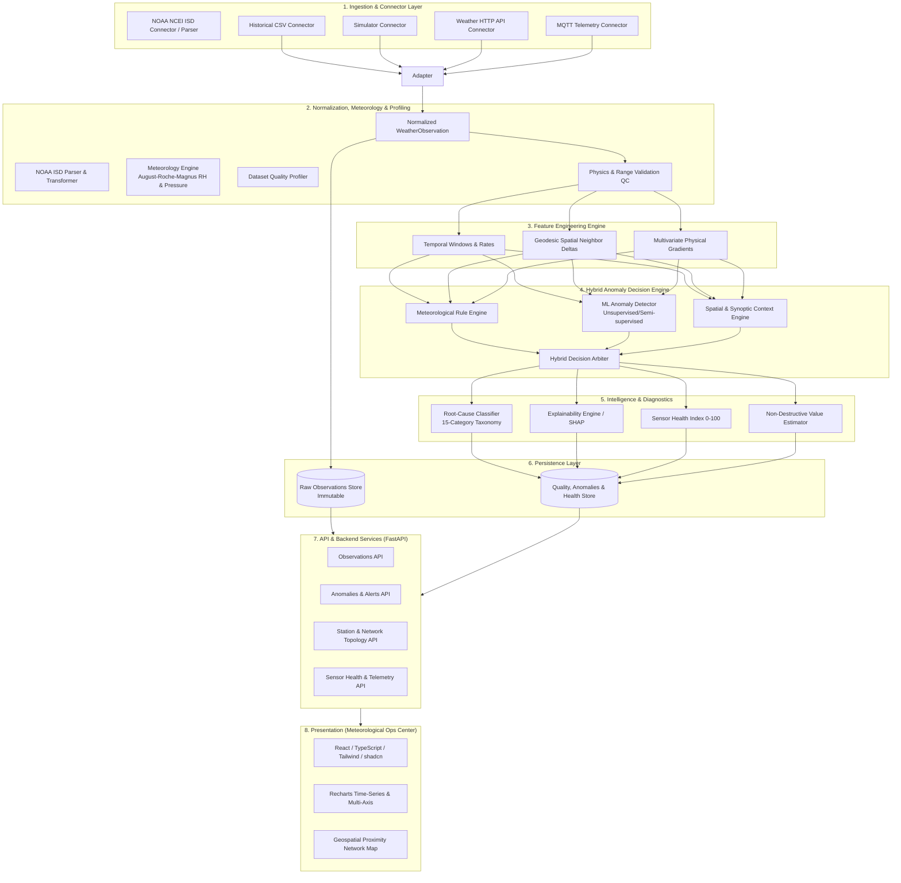
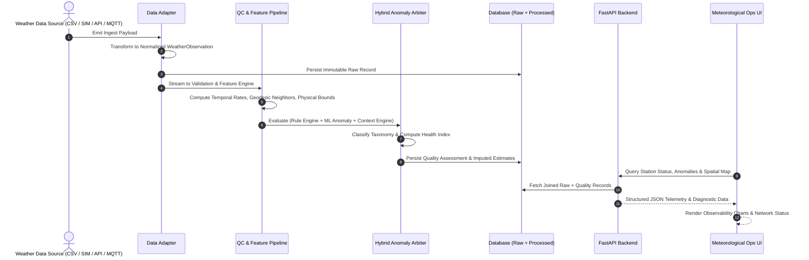

# SkyGuard AI — System Architecture Specification

## 1. System Overview
**SkyGuard AI** is an enterprise-grade meteorological data quality, anomaly detection, and sensor health monitoring platform. It addresses the operational fragility of Automatic Weather Station (AWS) networks by separating raw telemetry from derived quality assessments, combining physical meteorology rules with machine learning, and delivering high-density operational observability.

---

## 2. Component Diagram



---

## 3. End-to-End Data Flow



---

## 4. Backend Responsibilities (FastAPI)
- **Schema Validation**: Enforce strict Pydantic v2 schemas on all ingress and egress points.
- **Data Ingestion Orchestration**: Ingest telemetry from modular connectors and dispatch to pipeline workers.
- **RESTful API Service**: Expose clean, documented endpoints for station metadata, real-time telemetry, historical queries, anomaly drilldowns, and sensor health metrics.
- **Database Abstraction**: Use SQLAlchemy 2.0 ORM / Core repositories to maintain seamless compatibility between SQLite (local development) and PostgreSQL / TimescaleDB (production).
- **Configuration & Security**: Centralize configuration management with environment variable overrides and sanitize all outbound error payloads.

---

## 5. ML & Context Responsibilities
- **Spatial & Synoptic Context Engine (Phase 4 — COMPLETED)**: Evaluates multi-station geographic consistency across candidate AWS observations using exact geodesic distance (Haversine), forward compass azimuth, and elevation tracking. Emits structured contextual evidence (`LOCAL_ONLY`, `LOCAL_CLUSTER`, `REGIONAL_PATTERN`, `INSUFFICIENT_CONTEXT`) under strict causal forward-time exclusion ($t_{\text{neighbor}} \le t_{\text{target}}$).
- **Unsupervised / Semi-Supervised Anomaly Detection (Phase 3 — COMPLETED)**: Process engineered features (z-scores, sliding-window standard deviations, diurnal trend residuals) using isolation forests and robust statistical estimators.
- **Score Representation**: ML anomaly scores are output as normalized distance/anomaly metrics, **not** mislabeled as calibrated probabilities.
- **Hybrid Decision Engine (Phase 5 — COMPLETED)**: Hierarchical 7-gate multi-evidence arbiter combining data quality, planetary limits, temporal invariance, multivariate thermodynamics, single-station ML, and spatial context into structured classifications (`NORMAL`, `POSSIBLE_GENUINE_EVENT`, `PROBABLE_SENSOR_ANOMALY`, `PROBABLE_DATA_QUALITY_ISSUE`, `UNCERTAIN`).
- **Explainability & Anomaly Investigation (Phase 6A — COMPLETED)**: Real TreeSHAP local feature attributions on Isolation Forest, strictly causal neighbor comparisons, anomaly episode lifecycle reconstructions, and 4-tier structured evidence hierarchies.
- **Sensor Health Indexing & Degradation Tracking (Phase 6B — COMPLETED)**: Implemented in `ml/health/` (`SensorHealthEngine`). Computes continuous 0-100 degradation scoring across 5 component dimensions, channel-level isolation, recency weighting, and actionable maintenance recommendations without uncalibrated failure probabilities.
- **Controlled Evaluation**: Support synthetic anomaly injection on historical baseline datasets with separated ground-truth evaluation pipelines.


---

## 6. Frontend Responsibilities (React / TypeScript / Tailwind)
- **Aesthetic Direction**: **Meteorological Operations Center / Weather Mission Control**.
- **Information Density**: Display multi-parameter time-series, spatial network status, and anomaly severity without decorative fluff.
- **State Management**: TanStack Query for efficient polling, caching, and optimistic query states.
- **Geospatial Proximity Visualization**: Render AWS network across India with inter-station distance links and neighbor consistency badges.
- **Diagnostic Drilldown**: Side-by-side inspection of immutable raw data, model-recommended imputation, rule triggers, and SHAP explainability charts.

---

## 7. Database Responsibilities
- **Strict Storage Separation**:
  1. `raw_observations`: Read-only, append-only store preserving the exact sensor payload as ingested.
  2. `observation_quality`: Quality flags, anomaly classifications, severity scores, and rule triggers.
  3. `imputed_values`: Separate table storing estimated/corrected values with derivation metadata.
  4. `sensor_health_logs`: Hourly/daily aggregated health scores, drift markers, and uptime logs.
  5. `stations`: Metadata, geodetic coordinates (lat, lon, elevation), hardware specs, and baseline intervals.

---

## 8. Data Adapter Design
All data connectors inherit from an abstract `BaseConnector` interface and output a strictly normalized `WeatherObservation` object:

```python
class BaseConnector(ABC):
    @abstractmethod
    def connect(self) -> None: ...
    
    @abstractmethod
    def fetch_observations(self) -> Generator[WeatherObservation, None, None]: ...
    
    @abstractmethod
    def disconnect(self) -> None: ...
```

Supported Connector Types:
1. `HistoricalCSVConnector`: Reads historical batch datasets from disk.
2. `SimulatorConnector`: Generates configurable synthetic weather series with optional injected faults.
3. `WeatherAPIConnector`: Polls external weather HTTP REST services (stubbed for future phases).
4. `MQTTConnector`: Subscribes to telemetry broker topics (stubbed for future phases).

---

## 9. Separation of Raw vs. Processed Data
- **Immutability Guarantee**: Raw sensor records are never modified, overwritten, or discarded.
- **Auditability**: Every quality record references the `raw_observation_id` as a foreign key.
- **Reprocessability**: If ML model weights or quality rules are updated, the pipeline can reprocess historical raw observations without data corruption.

---

## 10. Future Real-Time Architecture
- Streaming ingest pipeline using an asynchronous broker (Redis Streams / Apache Kafka / RabbitMQ).
- Sliding-window state store in Redis for temporal rolling statistics (5-min, 1-hour, 24-hour windows).
- Asynchronous task processing (Celery / ARQ / FastAPI Background Tasks).
- WebSockets / Server-Sent Events (SSE) for sub-second push updates to the Meteorological Operations Center UI.

---

## 11. Future Cloud Architecture
- **Containerization**: Multi-stage Dockerfiles for backend API, worker pipelines, and static frontend build.
- **Database**: Managed PostgreSQL + TimescaleDB extension for hypertable time-series indexing.
- **Compute**: Stateless FastAPI containers on AWS ECS / Google Cloud Run / Kubernetes.
- **Object Storage**: S3 / GCS for storing serialized model artifacts (`joblib`), synthetic injection logs, and raw CSV archives.

---

## 12. Future Edge Architecture
- *(Reserved for future phases)*
- Quantized edge anomaly inference (ONNX Runtime / TFLite Micro).
- Local SQLite buffering during communication outages with guaranteed catch-up sync.

---

## 13. Security Considerations
- **Environment Isolation**: All credentials and sensitive connection strings loaded via `.env` files; `.env` excluded from version control.
- **Input Sanitization**: Pydantic schema validation on all API endpoints rejects malformed types, non-numeric strings, and out-of-range payloads.
- **CORS & Rate Limiting**: Controlled origin whitelisting and rate limiting on public ingest endpoints.
- **No Secret Leakage**: Stack traces and internal database errors masked in production responses.

---

## 14. Scalability Considerations
- **Station Network**: Baseline design handles 20+ stations; partitioning by `station_id` and indexing on `timestamp` allows scale to 10,000+ stations.
- **Spatial Matrix Optimization**: Geodesic k-nearest neighbor (k-NN) spatial tree (k-d tree or BallTree with haversine metric) cached in memory for $O(\log N)$ neighbor lookups.
- **Stateless Services**: Backend API workers run statelessly behind a load balancer.

---

## 15. Failure Handling & Resilience
- **Missing Telemetry**: Pipeline identifies missing intervals via expected cadence (e.g., 5-min intervals) and creates `MISSING_DATA` quality records.
- **Malformed Packets**: Ingestion layer routes corrupt payloads to a `dead_letter_records` table without breaking pipeline batch flow.
- **ML Engine Degraded Mode**: If ML inference service fails or throws exceptions, the system gracefully falls back to deterministic meteorological rule checks.

---

## 16. Observability & Logging Strategy
- **Structured JSON Logging**: Standard log fields: `timestamp`, `level`, `service`, `station_id`, `event_type`, `latency_ms`, `message`.
- **Log Categorization**:
  - `ingestion.event`: Ingestion receipts and batch stats.
  - `validation.failure`: Physics boundary check violations.
  - `anomaly.detected`: Triggered rule or ML anomaly classification.
  - `system.error`: Uncaught exceptions and database connectivity alerts.
- **Zero Secrets**: Scrubbing filters prevent tokens, connection strings, or PII from entering logs.

---

## 17. Model Versioning Strategy
- Model artifacts tagged with semantic versioning and commit SHA (e.g., `model_v1.2.0_20260916.joblib`).
- Metadata file accompanying each serialized artifact recording: training dataset hash, feature schema version, hyperparameters, synthetic evaluation scores, and creation timestamp.
- Quality assessment records store the `model_version` used during inference for full historical traceability.
