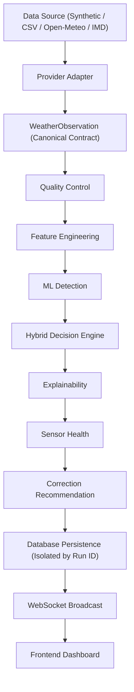

# SkyGuard AI — Unified Data Source & Run Context Architecture

## Overview
SkyGuard AI implements a unified **Data Source Control Plane** and **Run Context Architecture**. This design decouples raw weather observation ingestion from downstream quality control, feature engineering, ML detection, hybrid decision engine, explainability, sensor health, correction recommendation, database persistence, WebSocket broadcasting, and frontend dashboard displays.

Regardless of origin, every observation enters the exact same canonical processing pipeline:



> [!IMPORTANT]
> - **Single Pipeline Guarantee**: The anomaly engine does NOT check `if source == synthetic` or `if source == csv` to change detection logic. Anomaly algorithms operate identically across all data sources.
> - **Ground Truth Isolation**: Ground-truth evaluation labels are isolated from model features and passed exclusively in evaluation metadata for `EXPECTED vs ACTUAL` comparison.

---

## 1. Supported Data Sources & Run Modes

| Data Source | Source Type | Supported Run Modes | Ground Truth Available | Key Config / Auth |
| :--- | :--- | :--- | :--- | :--- |
| **Synthetic Validation Replay** | `SYNTHETIC_VALIDATION` | `SYNTHETIC_REPLAY` | **YES** (24 scenarios) | Local Phase 13A benchmark file (`seed=42`) |
| **Historical CSV** | `HISTORICAL_CSV` | `HISTORICAL_ANALYSIS`, `HISTORICAL_REPLAY` | **Optional** (If labeled) | CSV schema normalizer & column mapping |
| **Open-Meteo Live API** | `OPEN_METEO` | `LIVE_MONITORING` | **NO** | Free public endpoint (No key required) |
| **IMD AWS** | `IMD_AWS` | `LIVE_MONITORING` | **NO** | Architectural slot (`NOT CONFIGURED`) |

---

## 2. Canonical `RunContext` Contract

Every execution run generates a canonical `RunContext` object accessible to backend processing, APIs, WebSocket events, frontend dashboard, reports, and audit records:

```json
{
  "run_id": "RUN-20260917-001",
  "source_type": "SYNTHETIC_VALIDATION",
  "source_name": "Synthetic Benchmark Replay",
  "mode": "SYNTHETIC_REPLAY",
  "dataset_id": "synthetic_validation_v1",
  "dataset_version": "1.0.0",
  "station_count": 20,
  "observation_count": 5760,
  "cadence": "5 minutes",
  "start_time": "2026-09-17T00:00:00Z",
  "end_time": "2026-09-18T00:00:00Z",
  "ground_truth_available": true,
  "replay_speed": 300.0,
  "current_synthetic_time": "2026-09-17T09:35:00Z",
  "current_observation_index": 115,
  "transport": "WEBSOCKET",
  "database_target": "run_synthetic_db",
  "created_at": "2026-09-17T22:50:00Z",
  "status": "RUNNING"
}
```

---

## 3. Data Source Control Plane APIs

The system exposes REST endpoints under `/api/v1/runtime/`:

- `GET /api/v1/runtime/context` — Get active `RunContext`
- `GET /api/v1/runtime/providers` — List available provider configurations
- `POST /api/v1/runtime/source/select` — Select active source and mode (generates new `run_id`, stops active run safely)
- `POST /api/v1/runtime/run/start` — Start/Resume run
- `POST /api/v1/runtime/run/pause` — Pause active run
- `POST /api/v1/runtime/run/reset` — Reset run pointers to step 0
- `POST /api/v1/runtime/csv/preview` — Upload & analyze CSV dataset with schema auto-mapping preview
- `GET /api/v1/runtime/history` — Audit trail of previous execution runs

---

## 4. Frontend Control Plane & UI Behaviors

### Active Source Banner
The dashboard top bar displays:
`SOURCE: SYNTHETIC VALIDATION | MODE: SYNTHETIC REPLAY | TRANSPORT: WEBSOCKET | STATUS: RUNNING`

### Ground Truth & Expected vs Actual Display Rules
- **Synthetic Mode (`ground_truth_available = true`)**: Displays `EXPECTED`, `ACTUAL`, and `PASS/FAIL` validation labels.
- **Historical CSV / Live Mode (`ground_truth_available = false`)**: Displays `GROUND TRUTH: NOT AVAILABLE` and detected anomaly status without fabricating PASS/FAIL labels.

### Data Source Switching Rule
Switching data sources requires explicit user confirmation. Before switching, the current run stops, transient state resets, a new `RunContext` initializes, and data contamination across runs is prevented.

---

## 5. Security & Credentials
- All provider credentials (for optional paid live APIs) belong strictly in backend environment configuration (`.env`).
- Never expose API keys to Vite environment variables, React bundle, Git repositories, API responses, or WebSocket envelopes.
- Open-Meteo operates on the public free tier without requiring an API key.
