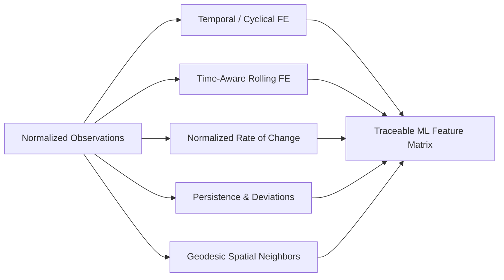

# SkyGuard AI — Feature Engineering Specification (Phase 2)

## 1. Overview
The SkyGuard AI Feature Engineering layer transforms validated, immutable meteorological time-series telemetry into high-dimensional physical and statistical feature matrices for downstream anomaly detection.

---

## 2. Feature Catalog

### 2.1. Temporal & Cyclical Features (`temporal.py`)
To prevent linear distance artifacts at circular boundaries (e.g. 23:59 to 00:00, or Dec 31 to Jan 1), cyclical attributes are transformed onto the unit circle:

| Feature Name | Formula / Description | Physical Significance |
|---|---|---|
| `hour` | Integer hour (0–23) in UTC | Diurnal cycle marker |
| `minute` | Integer minute (0–59) in UTC | Sub-hourly sampling phase |
| `day_of_year` | Day of calendar year (1–366) | Annual seasonality |
| `month` | Calendar month (1–12) | Seasonal climate regime |
| `day_of_week` | Day index (0=Monday, 6=Sunday) | Human/operational cycle correlation |
| `sin_hour`, `cos_hour` | $\sin\left(\frac{2\pi (H + M/60)}{24}\right), \cos\left(\frac{2\pi (H + M/60)}{24}\right)$ | Continuous diurnal phase embedding |
| `sin_day_of_year`, `cos_day_of_year` | $\sin\left(\frac{2\pi (\text{DOY}-1)}{365.25}\right), \cos\left(\frac{2\pi (\text{DOY}-1)}{365.25}\right)$ | Continuous annual solar cycle |
| `sin_day_of_week`, `cos_day_of_week` | $\sin\left(\frac{2\pi \cdot \text{DOW}}{7}\right), \cos\left(\frac{2\pi \cdot \text{DOW}}{7}\right)$ | Continuous weekly periodicity |

---

### 2.2. Time-Aware Rolling Statistics (`rolling.py`)
> [!IMPORTANT]
> Rolling windows are calculated over **actual elapsed time durations** (`15min`, `30min`, `1h`, `3h`, `6h`, `24h`), **not** fixed row counts. This ensures exact mathematical correctness across mixed cadences (1-min, 5-min, 30-min METAR, 3-hour synoptic).

For parameter $X \in \{\text{Temperature}, \text{Relative Humidity}, \text{Sea-Level Pressure}, \text{Station Pressure}\}$:
- `rolling_mean_<window>`: $\mu_W = \frac{1}{N_W}\sum_{t \in W} X_t$
- `rolling_std_<window>`: $\sigma_W = \sqrt{\frac{1}{N_W - 1}\sum_{t \in W} (X_t - \mu_W)^2}$ (with sample variance fallback $\sigma=0.0$ when $N_W < 2$)
- `rolling_min_<window>`, `rolling_max_<window>`: Local extrema over window $W$.
- `rolling_count_<window>`: Number of valid observations within duration window $W$.
- `lag_1`, `lag_2`, `lag_3`: Direct discrete observation step lags ($X_{t-1}, X_{t-2}, X_{t-3}$).

---

### 2.3. Rate of Change & Gradients (`change.py`)
- **First Difference**: $\Delta X_t = X_t - X_{t-1}$
- **Elapsed Duration**: $\Delta t = (t - t_{prev}) \text{ in minutes}$
- **Time-Normalized Rate**:
  $$\text{Rate}_{\text{per\_min}} = \begin{cases} \frac{X_t - X_{t-1}}{\Delta t}, & \text{if } \Delta t > 0 \\ \text{NaN}, & \text{if } \Delta t \le 0 \text{ or missing} \end{cases}$$
- `rate_per_5min` and `rate_per_hour`: Scaled derivatives for direct physical limit evaluation.
- `acceleration`: Second-order step difference $\Delta^2 X_t = \Delta X_t - \Delta X_{t-1}$.

---

### 2.4. Persistence & Local Deviations (`consistency.py`)
- **Consecutive Unchanged Count (`consecutive_unchanged_count`)**: Integer run-length counter of identical consecutive values (detects frozen sensors).
- **Duration Unchanged (`duration_unchanged_minutes`)**: Continuous elapsed minutes that the variable has remained stagnant.
- **Rounded Unchanged Count (`rounded_unchanged_count`)**: Run-length counter of repeated rounded readings (detects ADC bit-freezing or low resolution sticking).
- **Residual from Rolling Mean**: $R_t = X_t - \mu_W$
- **Standardized Z-Score**:
  $$Z_t = \frac{X_t - \mu_W}{\sigma_W + \epsilon}$$
- **Percentage Deviation**: $\frac{X_t - \mu_W}{\mu_W} \times 100\%$ (guarded against $|\mu_W| \le 0.1$).

---

### 2.5. Multivariate Physical Consistency (`consistency.py`)
- **Dew Point Spread**: $T - T_d$ (must be $\ge 0.0^{\circ}\text{C}$ in standard physics).
- **$\Delta T \times \Delta RH$ Interaction**: Evaluates anti-correlation during natural solar heating vs joint anomalous spikes.
- **Joint Standardized Anomaly Magnitude**:
  $$\text{AnomMag} = \sqrt{Z_T^2 + Z_{RH}^2 + Z_P^2}$$

---

### 2.6. Geodesic Spatial Neighborhood (`spatial.py`)
Uses the great-circle Haversine formula:
$$d = 2R \arcsin \left(\sqrt{\sin^2\left(\frac{\Delta \phi}{2}\right) + \cos(\phi_1)\cos(\phi_2)\sin^2\left(\frac{\Delta \lambda}{2}\right)}\right)$$

- **Elevation-Adjusted Barometric Comparison**: Station pressures are normalized to Mean Sea Level (MSL) via the inverse hypsometric reduction before calculating spatial neighbor pressure deltas.
- **Neighborhood Features**:
  - `spatial_neighbor_count`: Number of simultaneous active neighbors within radius (e.g. 600 km).
  - `spatial_nearest_neighbor_dist_km`: Distance to closest active neighbor.
  - `spatial_temp_delta_from_neighbor_mean`: $T_{\text{target}} - \bar{T}_{\text{neighbors}}$
  - `spatial_neighbor_temp_median`, `spatial_neighbor_temp_std`: Robust central tendency and dispersion.
  - Corresponding deltas and statistics for Relative Humidity and Sea-Level Pressure.

---

## 3. Provenance & Zero Data Leakage
1. **Traceability**: Every feature row preserves `station_id`, `timestamp`, `source`, `data_quality_status`, and `is_synthetic`.
2. **Ground Truth Isolation**: Injected anomaly metadata, labels, and parameters are stored exclusively in external ground-truth registries and never leak into `FeaturePipeline.get_feature_columns()`.
3. **No Lookahead Bias**: Rolling windows use right-closed intervals $(t - W, t]$ and backward-looking lags, preventing future data leakage during time-series splitting.
