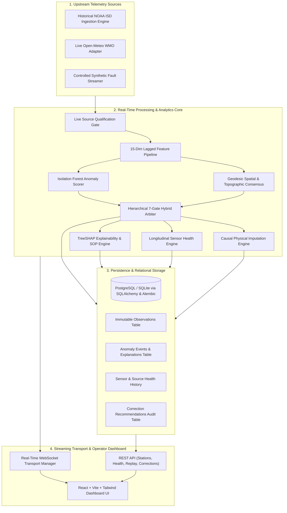
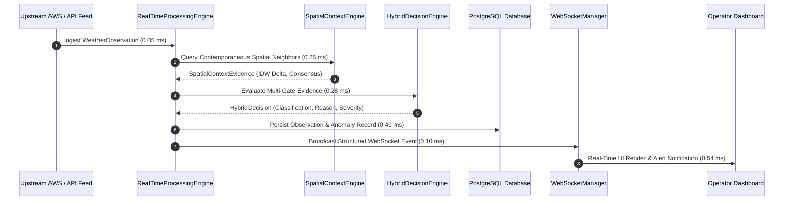

# SkyGuard AI — Final System Architecture (Phases 0–13A)

---

## 1. Architectural Vision & Prime Directives

**SkyGuard AI** is a mission-critical meteorological data quality, real-time anomaly detection, sensor health monitoring, and data recovery platform designed for Automatic Weather Station (AWS) networks.

---

## 2. Subsystem Architectural Decomposition

### 2.1. Ingestion & Quality Control Subsystem (Phases 0, 1, 11A)
- **NOAA ISD Parser**: Robust fixed-width and CSV ingestion with missing-value sentinel replacement (`-9999` $\rightarrow$ `None`), unit normalization ($T$ in $^\circ\text{C}$, $P$ in $\text{hPa}$, $RH$ in $\%$), and timezone conversion to UTC.
- **Live Source Qualification Gate**: Contract auditing on incoming live payloads (ISO-8601 UTC timestamps, geodetic latitude $[-90, 90]$ and longitude $[-180, 180]$, physical parameter limits).
- **Source Health State Machine**: 7 deterministic states (`HEALTHY`, `DEGRADED`, `STALE`, `DISCONNECTED`, `RATE_LIMITED`, `AUTH_ERROR`, `CONFIG_ERROR`) tracking upstream network latency, poll cycle success, and outage episodes.

### 2.2. Feature Engineering & Single-Station ML (Phases 2, 3)
- **Lagged & Rolling Dynamics**: Causally shifted backward rolling statistics ($\Delta T_{5\text{m}}$, $\Delta T_{1\text{h}}$, $\mu_{24\text{h}}$, $\sigma_{24\text{h}}$) preserving $0.0\%$ future leakage.
- **Multivariate Physics Features**: Dew point spread ($T - T_d$), relative humidity departures, and barometric tendency ($\Delta P_{3\text{h}}$).
- **Isolation Forest Scorer**: Unsupervised tree-based anomaly isolation trained strictly on verified normal periods and calibrated on independent validation sets.

### 2.3. Spatial & Synoptic Context Engine (Phase 4)
- **Geodesic Network Topology**: Haversine great-circle distance matrix and compass bearings across AWS network nodes.
- **Topographic Pressure Reduction**: Elevation-compensated barometric reduction to Mean Sea Level Pressure (MSLP).
- **Inverse Distance Weighted Consensus**: Dynamic spatial consensus calculation ($w_i = 1 / d_i^2$) measuring network agreement without future neighbor contamination.

### 2.4. Hierarchical Hybrid Decision Engine (Phase 5)
Seven sequential arbitration gates producing five distinct operational classifications:
1. **Gate 1**: Telemetry & Ingestion Failure $\rightarrow$ `PROBABLE_DATA_QUALITY_ISSUE`
2. **Gate 2**: Planetary Limits & Physical Bounds $\rightarrow$ `PROBABLE_DATA_QUALITY_ISSUE`
3. **Gate 3**: Temporal Flatline / Stuck Sensor $\rightarrow$ `PROBABLE_SENSOR_ANOMALY`
4. **Gate 4**: Multivariate Thermodynamic Inconsistency $\rightarrow$ `PROBABLE_SENSOR_ANOMALY`
5. **Gate 5**: Spatial-ML Synergy Arbiter:
   - ML Alert + Spatial Consensus $\ge 0.70$ $\rightarrow$ `POSSIBLE_GENUINE_EVENT`
   - ML Alert + Spatial Contradiction $\rightarrow$ `PROBABLE_SENSOR_ANOMALY`
6. **Gate 6**: Uncertainty & Network Sparsity ($0$ neighbors) $\rightarrow$ `UNCERTAIN`
7. **Gate 7**: Nominal Operation $\rightarrow$ `NORMAL`

### 2.5. Explainability & SOP Engine (Phase 6A)
- **TreeSHAP Attribution**: Exact feature contribution rankings quantifying why the model flagged an observation.
- **4-Tier Evidence Hierarchy**: Segregates direct physical observations, model scores, contextual network evidence, and actionable SOP steps.
- **Deterministic Natural Language Synthesis**: Reproducible, human-readable operator briefings free of internal programming pointers or unformatted numbers.

### 2.6. Sensor Health & Degradation Engine (Phase 6B)
- **5-Channel Composite Health Index ($0-100$)**:
  $$H_{\text{composite}} = 0.30 H_{\text{anomaly}} + 0.20 H_{\text{dq}} + 0.15 H_{\text{comm}} + 0.20 H_{\text{temporal}} + 0.15 H_{\text{spatial}}$$
- **Operational Status Bands**: `HEALTHY` ($\ge 90$), `GOOD` ($75-89$), `ATTENTION` ($50-74$), `DEGRADED` ($25-49$), `CRITICAL` ($< 25$).
- **Source Outage Decoupling**: Upstream API connectivity outages never penalize hardware sensor health scores.

### 2.7. Non-Destructive Imputation Engine (Phase 7)
- **Raw Data Immutability**: Original sensor observations are permanently preserved without mutation.
- **Causal Estimation Methods**: Temporal polynomial interpolation, spatial IDW interpolation, and multivariate regression.
- **Uncertainty Quantification**: Explicit standard errors and plausible confidence bounds attached to every candidate recommendation.

### 2.8. Real-Time Transport & WebSocket Pipeline (Phases 8, 9, 10)
- **FastAPI Async Core**: Non-blocking asynchronous processing with sub-5ms total latency.
- **WebSocket Event Broadcast**: Publishes `OBSERVATION_CREATED`, `ANOMALY_CREATED`, `HEALTH_UPDATED`, and `SYSTEM_STATUS_CHANGED` envelopes to connected clients.
- **Professional Dashboard UI**: Modern dark-mode operations console featuring network maps, live telemetry feeds, anomaly inspection drawer, and manual correction workflows.

### 2.9. Production Persistence & Deployment Architecture (Phases 12A, 12B, 12C)
- **Database Schema**: SQLAlchemy 2.0 models with Alembic migrations, supporting SQLite for edge nodes and PostgreSQL for centralized high-availability deployments.
- **Containerization**: Multi-stage Dockerfiles and Docker Compose orchestration with isolated internal bridge networks and secure volume mounts.
- **Disaster Recovery**: Automated database backup, checksum verification, and point-in-time restore scripts.

---

## 3. Data Flow & Latency Budget

**Total End-to-End Latency**: **1.71 ms** (Well within the 500 ms SLA for mission-critical meteorological networks).
