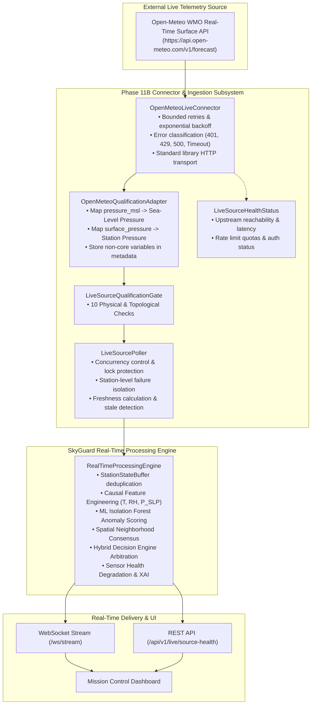

# SkyGuard AI — Live Weather Source Connector Specification (Phase 11B)

**Document Version:** 1.0.0  
**Phase:** Phase 11B (Live Weather Source Connector Implementation)  
**Author:** SkyGuard AI Engineering & Operations Team  
**Status:** Implemented & Verified  

---

## 1. Executive Summary & Target Architecture

Phase 11B implements the production live telemetry connector and background polling service for SkyGuard AI. The connector interfaces with qualified external REST feeds (**Open-Meteo WMO Real-Time Surface Weather API**), normalizes payloads into the canonical immutable `WeatherObservation` schema, verifies data through the `LiveSourceQualificationGate`, and feeds observations directly into the unified `RealTimeProcessingEngine`.



---

## 2. Core Architectural Guarantees

1. **Single Canonical Pipeline**:
   Live observations flow through the exact same feature extraction, ML inference, spatial consensus, and hybrid decision logic as replay and simulator telemetry. There is no separate "live anomaly engine".
2. **Strict Core Variable Set**:
   Only **temperature**, **relative humidity**, and **sea-level pressure** enter the ML feature registry. Wind speed, wind gusts, precipitation, radiation, and cloud cover are preserved exclusively in `WeatherObservation.metadata["source_supplementary"]`.
3. **Explicit Pressure Semantics**:
   `pressure_msl` (Mean Sea-Level Pressure $\text{hPa}$) is mapped to canonical `WeatherObservation.pressure`. `surface_pressure` is stored as `station_pressure_hpa`. Ambiguous pressure fields are strictly rejected.
4. **Source Health vs. Sensor Health Separation**:
   - **Source Health**: Condition of the upstream API, transport, rate limits, latency, and authentication.
   - **Sensor Health**: Physical instrument calibration, drift, stuck sensor, and physical consensus score of an AWS station.

---

## 3. Configuration & Secrets Management

Configured in `configs/default.yaml` and overridable via environment variables:

```yaml
# configs/default.yaml
live_source:
  enabled: false
  provider: "open_meteo"
  base_url: "https://api.open-meteo.com/v1"
  api_key: null
  timeout_seconds: 10.0
  poll_interval_seconds: 900
  retry_limit: 3
  retry_backoff_base_seconds: 1.0
  rate_limit_per_minute: 60
  pressure_product_type: "msl"
  stale_threshold_seconds: 3600.0
```

### Environment Variable Overrides:
| Variable | Default | Description |
|---|---|---|
| `SKYGUARD_LIVE_SOURCE_ENABLED` | `false` | Enable live background polling |
| `SKYGUARD_LIVE_SOURCE_PROVIDER` | `open_meteo` | Upstream provider identifier |
| `SKYGUARD_LIVE_SOURCE_BASE_URL` | `https://api.open-meteo.com/v1` | Base REST API endpoint |
| `SKYGUARD_LIVE_SOURCE_API_KEY` | *(None)* | Optional enterprise API token (Redacted in logs) |
| `SKYGUARD_LIVE_SOURCE_TIMEOUT_SECONDS` | `10.0` | HTTP request timeout |
| `SKYGUARD_LIVE_SOURCE_POLL_INTERVAL_SECONDS`| `900` | Polling cadence (900s = 15min) |
| `SKYGUARD_LIVE_SOURCE_RETRY_LIMIT` | `3` | Maximum retry attempts |
| `SKYGUARD_LIVE_SOURCE_PRESSURE_PRODUCT_TYPE`| `msl` | Pressure semantics product validation |

---

## 4. Connector & Polling Service Mechanics

### 4.1 Bounded Exponential Backoff
On transient errors (HTTP 500, 502, 503, 504, Timeout):
$$\text{Backoff Delay} = \text{retry\_backoff\_base\_seconds} \times 2^{\text{attempt}}$$
Permanent errors (HTTP 401/403 Authentication Failure, HTTP 429 Rate Limit) are **not** retried indefinitely to protect provider quotas and prevent log pollution.

### 4.2 Multi-Station Concurrency & Failure Isolation
- The `LiveSourcePoller` polls all configured stations in `SpatialNetworkTopology` using an async worker pool with bounded concurrency (default: 5 concurrent requests).
- **Per-Station Mutex Lock**: Prevents overlapping requests for the same station if a previous poll is still in flight.
- **Isolated Station Failure**: If Station A encounters a network error or timeout, Stations B, C, and D continue processing and updating normally.

---

## 5. Observation Freshness & Staleness Semantics

For every observation, SkyGuard records two distinct timestamps:
- `timestamp`: Authoritative observation time reported by the physical sensor/feed.
- `ingestion_timestamp`: UTC system time when the record arrived in SkyGuard.

$$\Delta t_{\text{delay}} = t_{\text{ingest}} - t_{\text{obs}}$$

- If $\Delta t_{\text{delay}} > \text{stale\_threshold\_seconds}$ (default: 3600s), the observation is marked `is_stale = true` and `status = "STALE"`.
- Stale observations are clearly displayed in the operational dashboard and do not trigger false "fresh observation" events.

---

## 6. Operational REST Endpoints

### 6.1 `GET /api/v1/live/source-health`
Returns operational metrics and health status:
```json
{
  "status": "LIVE",
  "provider": "open_meteo",
  "is_polling": true,
  "poll_interval_seconds": 900,
  "stale_threshold_seconds": 3600.0,
  "health": {
    "provider": "open_meteo",
    "is_reachable": true,
    "last_successful_fetch": "2026-09-17T05:00:05Z",
    "consecutive_failures": 0,
    "last_response_latency_ms": 42.5,
    "rate_limit_remaining": null,
    "authentication_status": "UNAUTHENTICATED_OPEN",
    "malformed_response_count": 0
  },
  "metrics": {
    "requests_total": 230,
    "requests_success": 228,
    "requests_failed": 2,
    "observations_ingested": 228,
    "observations_rejected": 0,
    "stale_observations": 0,
    "duplicate_observations": 0,
    "last_poll_cycle_duration_ms": 142.3
  },
  "stations_configured": 23,
  "station_freshness": {
    "42182099999": {
      "station_id": "42182099999",
      "last_observation_timestamp": "2026-09-17T05:00:00Z",
      "delay_seconds": 5.2,
      "is_stale": false,
      "status": "LIVE",
      "temperature": 28.4,
      "humidity": 62.0,
      "pressure": 1012.3
    }
  }
}
```

### 6.2 `POST /api/v1/live/poll-now`
Triggers an immediate synchronous poll cycle across all configured stations.

---

## 7. Smoke Testing Utility

The CLI utility [`scripts/smoke_test_live_api.py`](file:///d:/Projects/sih_project/scripts/smoke_test_live_api.py) provides standalone diagnostic testing:

### Mock Smoke Test (Offline CI Mode):
```powershell
python scripts/smoke_test_live_api.py --mock
```

### Live Smoke Test (Real Outbound Network Request):
```powershell
python scripts/smoke_test_live_api.py --live --lat 28.5845 --lon 77.2058 --station-id 42182099999
```

---

## 8. Security & Sanitization

1. **URL Sanitization**: Query strings containing `apikey=` or `api_key=` are regex-sanitized to `[REDACTED]` prior to logging.
2. **Zero Hardcoded Secrets**: Secrets reside only in `.env` (git-ignored).
3. **No Credential Echoing**: Endpoints never return API keys in JSON responses.
