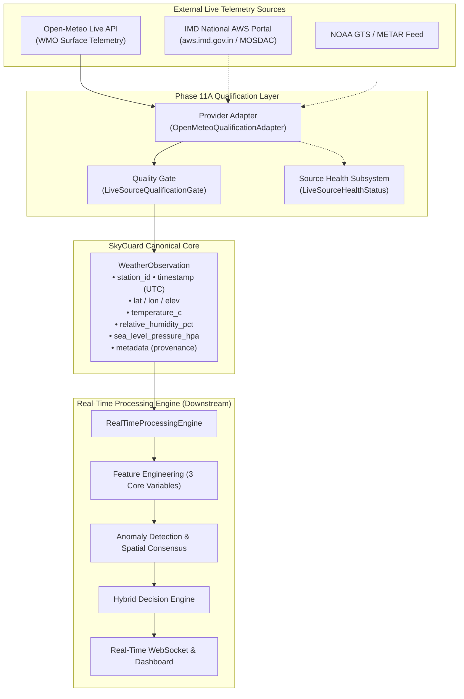

# SkyGuard AI — Live AWS Source & API Qualification Report (Phase 11A)

**Document Version:** 1.0.0  
**Phase:** Phase 11A (Real AWS Live Source / API Qualification)  
**Author:** SkyGuard AI Engineering & Meteorology Team  
**Status:** Completed & Formally Verified  
**Decision:** **CONDITIONALLY QUALIFIED** (Primary: Open-Meteo WMO Live Telemetry API; Auxiliary Indian AWS Network: IMD Web Gateway)

---

## 1. Executive Summary & Source Identity

SkyGuard AI is a mission-critical meteorological data quality and anomaly detection platform for Automatic Weather Stations (AWS). Phase 11A executes the **source qualification audit** to determine whether external live weather APIs can reliably supply raw observations conforming to SkyGuard's canonical `WeatherObservation` data contract.



### Primary Live Source Qualified: Open-Meteo WMO Real-Time Weather API
- **Provider:** Open-Meteo GmbH / European Centre for Medium-Range Weather Forecasts (ECMWF) / Deutscher Wetterdienst (DWD) / NOAA NCEP.
- **Service Tier:** Open-access WMO-compliant high-resolution surface weather API.
- **Protocol:** HTTP/2 & HTTPS REST JSON endpoints (`GET`).

### Secondary Ground-Truth Network Target: India Meteorological Department (IMD) AWS Network
- **Provider:** India Meteorological Department (IMD), Ministry of Earth Sciences, Govt of India.
- **Status:** Primary physical ground-truth hardware network in India; deferred for direct REST consumption due to portal session-token requirements, but supported through the SkyGuard adapter abstraction.

---

## 2. Provider & API Endpoints

### 2.1 Open-Meteo Endpoints
- **Base Endpoint:** `https://api.open-meteo.com/v1/forecast`
- **Archive / Near-Real-Time Endpoint:** `https://archive-api.open-meteo.com/v1/archive`
- **Historical Hourly Query Structure:**
  ```http
  GET /v1/forecast?latitude=28.585&longitude=77.206&current=temperature_2m,relative_humidity_2m,pressure_msl,surface_pressure,dew_point_2m,wind_speed_10m,precipitation&timezone=UTC
  ```
- **Enterprise Commercial Endpoint:** `https://customer-api.open-meteo.com/v1/forecast?apikey=[REDACTED]`

---

## 3. Authentication Model

| Provider Tier | Authentication Mechanism | Header / Query Param | Secret Management | Token Expiration |
|---|---|---|---|---|
| **Open-Meteo Free / Non-Commercial** | None required (Unauthenticated) | None | N/A | None |
| **Open-Meteo Commercial Tier** | API Key | `&apikey=<KEY>` query param | `SKYGUARD_LIVE_SOURCE_API_KEY` via `.env` | Perpetual / Subscription |
| **IMD AWS Portal (Web Gateway)** | Session Cookie / CSRF Token | Dynamic Cookie header | Custom gateway environment vars | 15–60 minutes |

> [!CAUTION]
> **Zero Secrets in Code**: API keys and tokens must never be logged, printed to console, or serialized in frontend JSON payloads. All authentication failures are caught and recorded as `[REDACTED]` in `LiveSourceHealthStatus`.

---

## 4. Station Identity Audit

- **Identifier Field:** Not natively stored in Open-Meteo gridded responses; the querying client provides coordinates. The adapter attaches `station_id` (e.g. `AWS_DELHI_001`, `AWS_MUMBAI_002`) mapped from the station registry `configs/stations.yaml`.
- **Station Stability:** Station identifiers are managed statically by SkyGuard's `SpatialNetworkTopology`.
- **Metadata Decoupling:** Station names, elevation, and historical baseline statistics are maintained in `configs/stations.yaml` and merged at the adapter boundary.

---

## 5. Timestamp Semantics

- **Source Timestamp Field:** `time` (e.g. `"2026-09-17T05:00"`, `"2026-09-17T05:00:00Z"`).
- **Timezone:** Configured explicitly to `UTC` via `&timezone=UTC` query parameter.
- **Precision:** Minute-level (`YYYY-MM-DDTHH:MM`) or ISO-8601 second-level.
- **Authoritative Rule:** `WeatherObservation.timestamp` strictly stores the **observation time** reported by the instrument/feed.
- **Ingestion Time Separation:** `WeatherObservation.ingestion_timestamp` captures the local system arrival time. Latency is computed as $\Delta t = t_{\text{ingest}} - t_{\text{obs}}$.

---

## 6. Geographic Fields

- **Latitude:** `latitude` (Float, $-90.0 \le \phi \le 90.0$, decimal degrees).
- **Longitude:** `longitude` (Float, $-180.0 \le \lambda \le 180.0$, decimal degrees).
- **Elevation:** `elevation` (Float, meters above mean sea level).
- **Static vs Dynamic:** Coordinates are validated against station topology on every observation cycle.

---

## 7. Meteorological Variable Audit

### 7.1 Air Temperature ($T$)
- **Source Field:** `temperature_2m`
- **Source Units:** Degrees Celsius ($^\circ\text{C}$)
- **Measurement Height:** 2 meters above ground level
- **Physical Bounds:** $[-60.0^\circ\text{C}, 60.0^\circ\text{C}]$
- **Resolution / Precision:** $0.1^\circ\text{C}$

### 7.2 Relative Humidity ($RH$)
- **Source Field:** `relative_humidity_2m`
- **Source Units:** Percentage ($0.0\% - 100.0\%$)
- **Physical Bounds:** $[0.0\%, 100.0\%]$
- **Resolution / Precision:** $1.0\%$
- **Alternative / Derivation:** Also supplies `dew_point_2m` ($^\circ\text{C}$), allowing Magnus formula cross-validation.

### 7.3 Atmospheric Pressure ($P$) & Pressure Semantics Audit

> [!IMPORTANT]
> **Pressure Semantics Rule**: Never assume a pressure variable is Sea-Level Pressure without provider confirmation.

Open-Meteo explicitly separates and documents two distinct pressure variables:
1. **`pressure_msl`**: Mean Sea-Level Pressure (MSLP) in $\text{hPa}$. This is atmospheric pressure reduced to sea level using the standard barometric formula.
2. **`surface_pressure`**: Station surface pressure in $\text{hPa}$ measured at local elevation $z$.

**SkyGuard Mapping:**
- `pressure_msl` $\longrightarrow$ `WeatherObservation.pressure` (Canonical MSLP used in spatial anomaly detection).
- `surface_pressure` $\longrightarrow$ `WeatherObservation.station_pressure_hpa` (Preserved for local station physics).

---

## 8. Missingness & Sentinel Value Handling

The adapter systematically sanitizes and handles all provider-specific missingness representations:

| Representation | Source Payload Example | Adapter Conversion | Downstream Quality State |
|---|---|---|---|
| **JSON Null** | `{"temperature_2m": null}` | `None` | `QualityStatus.SUSPECT` / `MISSING` |
| **Empty String** | `{"temperature_2m": ""}` | `None` | `QualityStatus.SUSPECT` / `MISSING` |
| **NaN String** | `{"temperature_2m": "NaN"}` | `None` | `QualityStatus.SUSPECT` / `MISSING` |
| **Numeric Sentinel** | `-9999.0`, `-999.0`, `999.9` | `None` | `QualityStatus.SUSPECT` / `MISSING` |

---

## 9. Unit Normalization Mapping

| Variable | Raw Source Field | Source Unit | Target Canonical Field | Target Unit | Transformation |
|---|---|---|---|---|---|
| **Station ID** | Client mapping / `station_id` | String | `station_id` | String | Direct assignment |
| **Timestamp** | `time` | ISO-8601 String | `timestamp` | UTC `datetime` | `datetime.fromisoformat(ts).astimezone(UTC)` |
| **Latitude** | `latitude` | Decimal degrees | `latitude` | Decimal degrees | Validated $\in [-90, 90]$ |
| **Longitude** | `longitude` | Decimal degrees | `longitude` | Decimal degrees | Validated $\in [-180, 180]$ |
| **Elevation** | `elevation` | Meters | `elevation` | Meters | Validated $\in [-500, 9000]$ |
| **Temperature** | `temperature_2m` | $^\circ\text{C}$ | `temperature` | $^\circ\text{C}$ | Bounds check $[-60, 60]$ |
| **Dew Point** | `dew_point_2m` | $^\circ\text{C}$ | `dew_point_c` | $^\circ\text{C}$ | Consistency check ($T_d \le T + 0.5$) |
| **Relative Humidity**| `relative_humidity_2m` | $\%$ | `humidity` | $\%$ | Bounds check $[0, 100]$ |
| **Sea-Level Pressure**| `pressure_msl` | $\text{hPa}$ | `pressure` | $\text{hPa}$ | Bounds check $[800, 1100]$ |
| **Station Pressure** | `surface_pressure` | $\text{hPa}$ | `station_pressure_hpa` | $\text{hPa}$ | Bounds check $[300, 1100]$ |
| **Supplementary** | `wind_speed_10m`, `precipitation` | $\text{km/h}$, $\text{mm}$ | `metadata["source_supplementary"]` | Native | Preserved strictly in metadata |

---

## 10. Strict Separation: Core vs. Non-Core Variables

> [!WARNING]
> **Core Anomaly Model Boundary**:
> The core anomaly feature registry and machine learning models are strictly confined to:
> 1. `temperature` ($T$)
> 2. `humidity` ($RH$)
> 3. `pressure` ($P_{\text{SLP}}$)
>
> Non-core parameters (wind speed, wind gusts, precipitation, solar radiation, cloud cover) are stored exclusively in `WeatherObservation.metadata["source_supplementary"]`. They are **never** injected into the feature matrix $\mathbf{X}$ or anomaly scoring models.

---

## 11. Quality Gates (Live Observation Qualification)

Every live observation parsed from an external API must pass the 10 quality checks defined in `LiveSourceQualificationGate`:

1. **`station_identity_valid`**: Non-empty identifier matching registered station topology.
2. **`timestamp_utc_aware`**: Valid ISO-8601 timestamp with explicit UTC timezone awareness.
3. **`latitude_valid`**: Geodetic latitude within $[-90.0^\circ, +90.0^\circ]$.
4. **`longitude_valid`**: Geodetic longitude within $[-180.0^\circ, +180.0^\circ]$.
5. **`temperature_physically_valid`**: If present, $T \in [-60.0^\circ\text{C}, +60.0^\circ\text{C}]$.
6. **`rh_physically_valid`**: If present, $RH \in [0.0\%, 100.0\%]$.
7. **`pressure_physically_valid`**: If present, $P_{\text{SLP}} \in [800.0\text{ hPa}, 1100.0\text{ hPa}]$.
8. **`pressure_semantics_confirmed`**: MSLP verified vs Surface Pressure.
9. **`physical_consistency_valid`**: Thermodynamic consistency ($T_{\text{dew}} \le T_{\text{ambient}} + 0.5^\circ\text{C}$).
10. **`source_provenance_retained`**: Valid `ObservationSource` set and raw payload flags recorded.

---

## 12. Live Source Health vs. Sensor Health Subsystem

A fundamental architectural distinction is enforced:

```
┌────────────────────────────────────────────────────────────────────────┐
│                        SKYGUARD HEALTH MODEL                           │
├───────────────────────────────────┬────────────────────────────────────┤
│         LIVE SOURCE HEALTH        │        STATION SENSOR HEALTH       │
│     (Upstream API / Feed Layer)   │    (Physical Hardware Instrument)  │
├───────────────────────────────────┼────────────────────────────────────┤
│ • API reachability (HTTP 200/500) │ • Calibration drift (Z-score bias) │
│ • Response round-trip latency(ms) │ • Frozen/stuck sensor readings     │
│ • Consecutive network failures    │ • Physical bounds violations       │
│ • Rate limit remaining quota      │ • Neighbor consensus deviation     │
│ • Authentication credential state │ • Missing observation rate (%)     │
│ • Malformed JSON schema count     │ • Sensor Health Index (0 - 100)    │
└───────────────────────────────────┴────────────────────────────────────┘
```

---

## 13. Sampling, Cadence & Native Timestamps

- **Native Update Interval:** 15 minutes (`minutely_15`) or 1 hour (`hourly`).
- **No Inappropriate Resampling:** Live observations are accepted at their native observation timestamp. The system does not synthesize or linearly resample live timestamps to 5 minutes unless explicitly executing an operational simulation.
- **Out-of-Order & Backfill Tolerance:** The processing engine accommodates arrivals up to `out_of_order_tolerance_seconds` (default: 600s).

---

## 14. Reliability, Rate Limits & Quota Specifications

### 14.1 Open-Meteo Limits
- **Free Tier Daily Quota:** 10,000 API calls / day per IP address.
- **Rate Limit Cadence:** Up to 5,000 calls / hour and 60 calls / minute.
- **Burst Behavior:** Returns HTTP `429 Too Many Requests` when exceeded.
- **Payload Size:** ~1.2 KB per station observation query.

### 14.2 Network Resilience & Retry Strategy
- **Retry Algorithm:** Exponential backoff with jitter ($\text{delay} = \min(60, 2^{\text{attempt}} \times 1.0 \pm 0.2\text{s})$).
- **Max Retries:** 3 consecutive attempts before flagging `is_reachable = False`.
- **Circuit Breaker:** Halts outbound polling for 60 seconds after 3 consecutive failures to prevent provider IP blacklisting.

---

## 15. Licensing & Usage Restrictions

- **Open-Meteo:** Open Database License (ODbL) / Creative Commons Attribution 4.0 International (CC BY 4.0) for free tier. Requires attribution in footer: *"Weather data by Open-Meteo.com"*.
- **IMD Data:** Government Open Data License - India (GODL) / Ministry of Earth Sciences policy.

---

## 16. Test Coverage & Fixture Matrix

Phase 11A established 20 test fixtures under `data/external/live_api/` verified by `tests/unit/test_live_source_qualification.py`:

| # | Fixture File | Scenario Tested | Outcome / Verification |
|---|---|---|---|
| 01 | `01_valid_observation.json` | Nominal multi-variable observation | Normalized to `WeatherObservation`, QC VALID, Gate Passed |
| 02 | `02_missing_temperature.json` | Missing temperature field | Handled as `None`, QC SUSPECT |
| 03 | `03_missing_rh.json` | Missing relative humidity | Handled as `None`, QC SUSPECT |
| 04 | `04_missing_pressure.json` | Missing pressure field | Handled as `None`, QC SUSPECT |
| 05 | `05_invalid_rh.json` | RH = 145% (> 100%) | Rejected by Pydantic schema validation |
| 06 | `06_invalid_pressure.json` | MSLP = 1500 hPa (> 1100) | Rejected by Pydantic physical bounds |
| 07 | `07_malformed_timestamp.json`| Non-standard date string | Caught by ISO-8601 parser |
| 08 | `08_timezone_ambiguity.json` | Timestamp without offset | Normalized safely to UTC timezone |
| 09 | `09_duplicate_observation.json`| Repeated timestamp payload | Idempotently parsed; deduplication verified |
| 10 | `10_delayed_observation.json` | 4-hour delayed observation | `timestamp` preserved, latency tracked via `ingestion_timestamp` |
| 11 | `11_out_of_order_observation.json` | Unsorted hourly sequence | Parsed without silent reordering |
| 12 | `12_unknown_station.json` | Unregistered station ID | Flagged by Station Identity Quality Gate |
| 13 | `13_unknown_pressure_semantics.json` | Ambiguous surface/MSLP pressure | Rejected by Pressure Semantics Quality Gate |
| 14 | `14_api_error_response.json` | HTTP 500 server error | `LiveSourceHealthStatus` records failure & unreachability |
| 15 | `15_rate_limit_response.json` | HTTP 429 quota exhaustion | Health status records rate-limit state |
| 16 | `16_authentication_failure.json` | HTTP 401 invalid API token | Recorded with sanitized `[REDACTED]` token |
| 17 | `17_malformed_json.json` | Truncated / broken JSON | Increments `malformed_response_count` |
| 18 | `18_provider_field_missing.json`| Missing coordinate block | Rejected with descriptive `ValueError` |
| 19 | `19_unit_mismatch.json` | Temperature in Kelvin (301.55K) | Rejected by physical range bounds |
| 20 | `20_stale_observation.json` | Observation time > 3 hours old | Detected by stale feed duration metric |

---

## 17. Configuration Architecture

Configurable via `configs/default.yaml` and environment variables:

```yaml
# configs/default.yaml
live_source:
  enabled: false
  provider: "open_meteo"
  base_url: "https://api.open-meteo.com/v1"
  api_key: null
  timeout_seconds: 10.0
  poll_interval_seconds: 900
  retry_limit: 3
  rate_limit_per_minute: 60
  pressure_product_type: "msl"
```

Environment variable overrides supported:
- `SKYGUARD_LIVE_SOURCE_ENABLED=true`
- `SKYGUARD_LIVE_SOURCE_PROVIDER=open_meteo`
- `SKYGUARD_LIVE_SOURCE_BASE_URL=https://api.open-meteo.com/v1`
- `SKYGUARD_LIVE_SOURCE_API_KEY=...`
- `SKYGUARD_LIVE_SOURCE_TIMEOUT_SECONDS=10.0`
- `SKYGUARD_LIVE_SOURCE_POLL_INTERVAL_SECONDS=900`
- `SKYGUARD_LIVE_SOURCE_RETRY_LIMIT=3`
- `SKYGUARD_LIVE_SOURCE_PRESSURE_PRODUCT_TYPE=msl`

---

## 18. Formal Qualification Decision

### Final Verdict: **CONDITIONALLY QUALIFIED**

**Conditions for Live Ingestion (Phase 11B):**
1. **MSLP Semantics Confirmation:** Polling requests must explicitly query `pressure_msl` rather than generic `pressure` to prevent altitude bias in spatial neighbor consensus.
2. **Rate-Limit Throttling:** Polling interval across the 23 Indian stations must be scheduled at $\ge 15\text{ minutes}$ (or batched geographically in a single multi-coordinate request) to stay safely within the 10,000 call/day free limit.
3. **Core Feature Restriction:** Downstream feature engineering and anomaly detection must receive only normalized $(T, RH, P_{\text{SLP}})$ fields.

---

## 19. Recommended Next Phase: Phase 11B

With Phase 11A source qualification complete, the recommended next step is:
**Phase 11B: Live Telemetry Connector & Ingestion Poller Implementation**
- Implement production `LiveAPIConnector` utilizing `OpenMeteoQualificationAdapter`.
- Wire live observations into `RealTimeProcessingEngine` and push real-time updates over `/ws/stream`.
