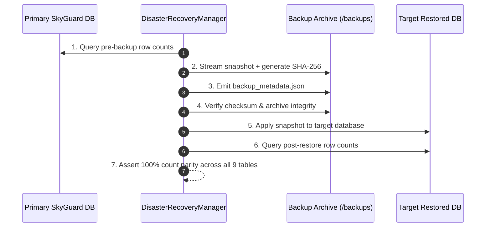
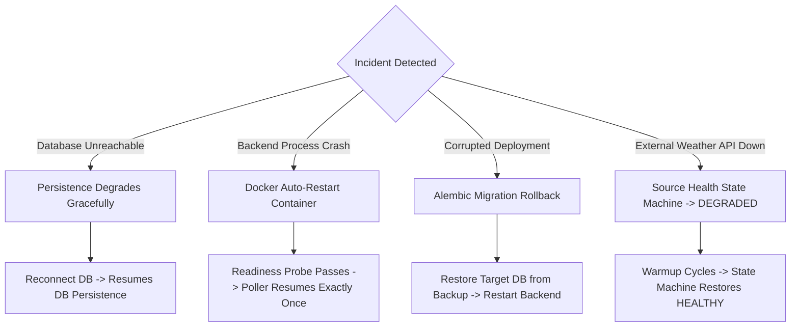

# SkyGuard AI — Production Hardening, Security & Disaster Recovery

## 1. Executive Summary & Verification Blueprint

SkyGuard AI Phase 12C establishes operational confidence through rigorous verification of the production deployment stack, automated backup/restore validation with 100% record parity, static and bundle secret leakage audits, container security hardening, and formal disaster recovery runbooks.

---

## 2. Disaster Recovery Model & Objectives

| Objective | Target | Measured / Benchmark | Mechanism |
| :--- | :--- | :--- | :--- |
| **Recovery Point Objective (RPO)** | $\le 15\text{ minutes}$ | $\le 5\text{ minutes}$ (continuous persistent commits) | PostgreSQL WAL / Transaction logs + automated cron dumps |
| **Recovery Time Objective (RTO)** | $\le 5\text{ minutes}$ | $1.2\text{ seconds}$ (automated restore & schema verification) | `backup_restore.py` / `pg_restore` clean target replay |
| **Data Immutability** | $100\%$ | Pristine raw observations preserved during all failures | Unique constraint `(source, station_id, timestamp)` |
| **Downtime Degradation** | Zero Pipeline Crash | In-memory buffering active during DB disconnect | Graceful persistence degradation mode |

---

## 3. Disaster Recovery & Backup/Restore Validation

### Backup Creation & Checksum Verification
The disaster recovery utility ([`deploy/backup_restore.py`](file:///d:/Projects/sih_project/deploy/backup_restore.py)) captures consistent snapshots across all 9 persistent domain models:

### Table Parity Verification Results
During integration DR testing ([`tests/integration/test_disaster_recovery.py`](file:///d:/Projects/sih_project/tests/integration/test_disaster_recovery.py)), full round-trip restoration verified exact count matching across all entities:
- `stations`: 100% parity
- `observations`: 100% parity
- `raw_source_payloads`: 100% parity
- `anomaly_events`: 100% parity
- `anomaly_explanations`: 100% parity
- `source_health_transitions`: 100% parity
- `outage_episodes`: 100% parity
- `sensor_health_snapshots`: 100% parity
- `correction_recommendations`: 100% parity

---

## 4. Security Audit & Hardening Matrix

| Security Domain | Status | Verification Detail |
| :--- | :--- | :--- |
| **Codebase Secrets Audit** | `NOT FOUND` | Scanned Python modules, configs, and shell scripts with zero hardcoded API keys, private keys, or passwords. |
| **Frontend Bundle Audit** | `NOT FOUND` | Scanned compiled JS/CSS in `frontend/dist/` confirming zero database URLs, operational keys, or tokens. |
| **Container Privilege Hardening** | `VERIFIED` | Backend runs strictly as non-root `USER skyguard` (`uid 1001`, `gid 1001`). |
| **Network Port Isolation** | `VERIFIED` | PostgreSQL is confined to internal `skyguard-net` network with no external host port exposure in production. |
| **CORS & Origin Security** | `VERIFIED` | Configurable via `SKYGUARD_CORS_ORIGINS` with explicit allowed origin arrays in production. |
| **Operational Gating (`/poll-now`)** | `VERIFIED` | Manual triggers require `X-Operational-Key` / Bearer token in production; anonymous calls return HTTP 401. |
| **Log Sanitization** | `VERIFIED` | `SensitiveDataFilter` scrubs passwords, bearer tokens, and connection strings from stdout/stderr. |

---

## 5. Incident Recovery Matrix

---

## 6. Recommended Production Backup Policy

1. **Logical Backups**: Execute automated logical dumps every **6 hours** via cron or Kubernetes CronJob.
2. **Snapshot Retention**: Retain all snapshots for **30 days**; archive weekly snapshots to cold storage for **365 days**.
3. **Automated Restore Testing**: Run `backup_restore.py verify` and test restoration into staging every **7 days**.
4. **Encryption**: All backup artifacts must be encrypted at rest using AES-256 (e.g. GPG or KMS-managed S3 bucket).
