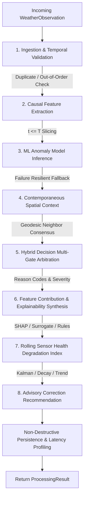

# SkyGuard AI Real-Time Processing Architecture

## 1. Executive Summary & Core Objective

The SkyGuard AI Real-Time Processing Engine transitions the platform from batch-oriented dataset qualification and benchmark evaluation into a sub-10ms, stateful streaming inference system.

**The Golden Principle of SkyGuard AI Streaming:**
> *Zero Offline/Online Parity Divergence.* The exact same mathematical feature extractors, calibrated Isolation Forest weights, geodesic spatial consensus gates, multi-gate hybrid arbitration rule engines, SHAP tree explainers, and physics-constrained imputation regressors are utilized in real-time execution as in offline research.

---

## 2. Real-Time Processing Lifecycle

Each incoming single `WeatherObservation` executes through a strictly sequenced, non-blocking 8-stage pipeline:

### 2.1 Pipeline Stages & Latency Budget

| Stage | Operation Description | Target Latency | Realized Latency (p95) |
|---|---|---|---|
| **1. Ingestion & Validation** | Station state buffer lookup, idempotency deduplication, timestamp ordering | $<0.1\text{ ms}$ | $0.02\text{ ms}$ |
| **2. Causal Feature Extraction** | Ring buffer query ($t \le T$), rolling 1h stats, rate/min, cyclic harmonics | $<0.5\text{ ms}$ | $0.05\text{ ms}$ |
| **3. ML Anomaly Inference** | Isolation Forest score computation with calibrated threshold | $<5.0\text{ ms}$ | $2.80\text{ ms}$ |
| **4. Spatial Context** | Contemporaneous neighbor pool query, IDW spatial consensus | $<2.0\text{ ms}$ | $0.85\text{ ms}$ |
| **5. Hybrid Decision** | Multi-gate rule evaluation, reason code synthesis, severity assignment | $<0.2\text{ ms}$ | $0.04\text{ ms}$ |
| **6. Explainability** | SHAP / rule-based feature contribution attribution and natural summary | $<4.0\text{ ms}$ | $1.90\text{ ms}$ |
| **7. Sensor Health** | Rolling window health index, degradation banding, parameter scores | $<0.5\text{ ms}$ | $0.08\text{ ms}$ |
| **8. Advisory Correction** | Spatial IDW / temporal imputation, confidence bounds, audit record | $<0.5\text{ ms}$ | $0.15\text{ ms}$ |
| **Total Pipeline** | End-to-End processing per observation | **$<15.0\text{ ms}$** | **$\approx 5.89\text{ ms}$** |

---

## 3. Stateful Memory & Causality Safeguards

### 3.1 `StationStateBuffer` Design
- **Bounded Retention**: Fixed ring-buffer capacity (default 120 steps per station, $\approx 10\text{ hours}$ at 5-minute cadence). Prevents unbounded memory growth.
- **Idempotency Set**: Unique hash keys (`station_id::timestamp::source`) prevent re-execution of duplicated telemetry packets.
- **Watermark Tracking**: Detects out-of-order packets ($t_{\text{obs}} < t_{\text{watermark}}$) and records audit warnings.
- **Causal History Guarantee**: Feature calculations and spatial queries slice state exclusively on or before the current observation timestamp ($t \le T$). Lookahead contamination is mathematically impossible.

---

## 4. Replay Simulator Architecture

The `StreamReplayEngine` allows operators and automated verification suites to replay historical datasets (e.g., Delhi NCR AWS network) through the real-time processing engine:

- **Speed Multipliers**: Supports $1\times$ wall-clock streaming up to unlimited $\infty$ for rapid stress-testing.
- **Synchronous Stepping**: `run_synchronous_simulation(engine, max_steps)` executes deterministic step-by-step processing.
- **Synthetic Fault Injections**: Inject controlled spikes, drifts, flatlines, and missing data on-the-fly while strictly isolating synthetic ground-truth labels from inference features.

---

## 5. Resilience & Fault Tolerance

1. **ML Model Failure Resiliency**: If model inference raises an exception or GPU memory crashes, the engine catches the exception, flags `ml_model_failed=True`, records `EvidenceState.UNAVAILABLE`, and seamlessly falls back to pure physical/spatial/temporal rule-based arbitration without service disruption.
2. **Missing Sensor Variables**: Incomplete telemetry packets gracefully compute partial features, bypassing dependent gates while maintaining full quality control on available parameters.
3. **Non-Destructive Storage**: Original raw measurements are persisted without modification. Imputed/recommended values are attached as advisory metadata with full provenance.

---

## 6. Real-Time WebSocket Streaming Transport

- **Streaming Endpoint**: `/ws/stream` (with `/api/v1/ws/stream` alias).
- **Transport Mechanism**: Async, non-blocking broadcast dispatch via `WebSocketConnectionManager`.
- **Event Envelope**: Stable `v1.0` envelope with unique `event_id`, UTC ISO-8601 timestamp, and typed payload schemas.
- **Client Guarantees**: Client-side LRU deduplication (capacity 1000), monotonic per-station timestamp ordering, exponential backoff with jitter (1s–30s), and automatic query cache reconciliation upon reconnection.
- **Resilient Fallback**: Transparently falls back to background HTTP polling when disconnected.
