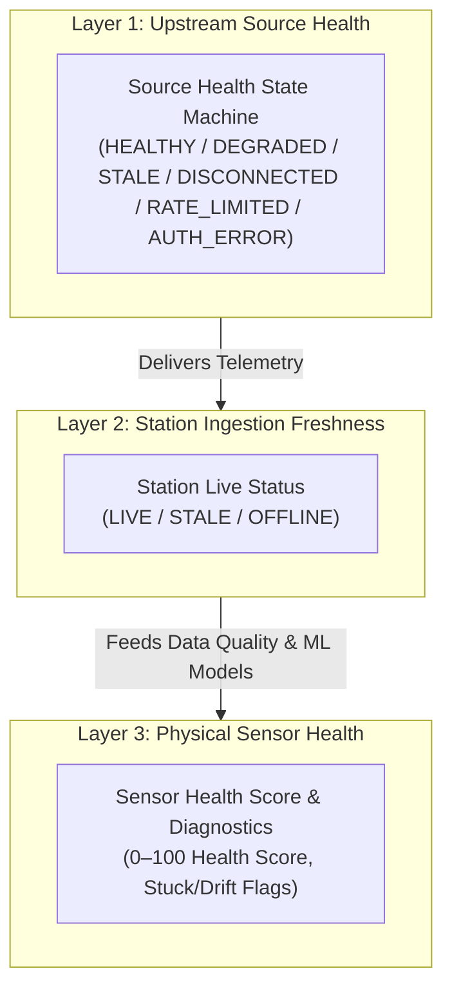
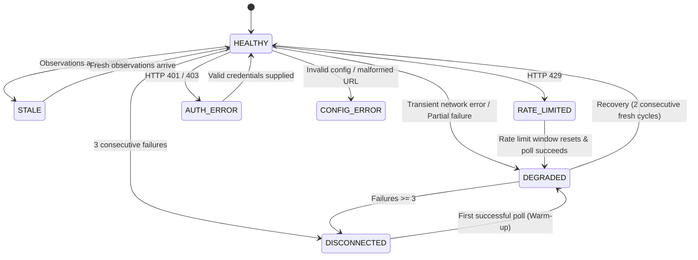

# SkyGuard AI: Source Health & Live Operations Specification

**Phase 11C Operational Engineering Specification**  
**Document Version:** 1.0.0  
**Status:** Canonical Reference  

---

## 1. Executive Summary & Prime Directive

In a mission-critical meteorological anomaly platform, **Source Health** (the operational integrity and communication condition of the upstream data feed) must be strictly isolated from **Sensor Health** (the physical instrument integrity of individual Automatic Weather Stations). 

An upstream network timeout, authentication expiration, or stale provider feed must never falsely degrade an AWS sensor's physical health index or trigger synthetic hardware drift alerts.



---

## 2. Source Health State Machine

The upstream source state machine transitions deterministically based on observed network events, HTTP codes, observation timestamps, and recovery criteria:

| State | Definition | Trigger Conditions |
| :--- | :--- | :--- |
| **`HEALTHY`** | Upstream API is fully operational, responsive, and delivering fresh observations. | $0$ consecutive failures, observations $\le \text{stale\_threshold}$, recovery warm-up satisfied. |
| **`DEGRADED`** | System experiencing transient network retries, partial station parsing failures, or is in recovery warm-up. | $1 \le \text{consecutive\_failures} < 3$, or $< 100\%$ stations failed, or recovery warm-up. |
| **`STALE`** | HTTP communication is successful, but data timestamps exceed `stale_threshold_seconds` ($3600\text{s}$). | Observations received with age $> \text{stale\_threshold_seconds}$. |
| **`DISCONNECTED`** | Outage threshold exceeded; no successful communication. | $\text{consecutive\_failures} \ge \text{outage\_consecutive\_failures}$ (default: $3$). |
| **`RATE_LIMITED`** | Upstream provider API rate limit exceeded. | HTTP status `429 Too Many Requests`. |
| **`AUTH_ERROR`** | Invalid, expired, or missing API credentials. | HTTP status `401 Unauthorized` or `403 Forbidden`. |
| **`CONFIG_ERROR`** | Malformed endpoint URL, invalid coordinates, or unparseable configuration. | Invalid URL or unresolvable configuration parameter. |

### Deterministic State Transition Matrix



---

## 3. Station Live Freshness Status

Each Automatic Weather Station in the network topology maintains an isolated live ingestion record:

- **`LIVE`**: A valid observation was received with age $\le \text{stale\_threshold\_seconds}$ ($3600\text{s}$).
- **`STALE`**: Observation received, but observation timestamp is older than $3600\text{s}$.
- **`OFFLINE`**: Station has not delivered an observation or has failed consecutively $\ge 3$ times.

### Tracked Per-Station Fields
- `station_id`: Geodetic station identifier.
- `status`: `LIVE` | `STALE` | `OFFLINE`.
- `last_observation_timestamp`: ISO 8601 UTC timestamp of the observation.
- `last_ingestion_timestamp`: ISO 8601 UTC timestamp when SkyGuard received the payload.
- `observation_age_seconds`: Elapsed time since observation measurement.
- `ingestion_latency_seconds`: Delivery delay from measurement to ingestion.
- `consecutive_failures`: Consecutive failed poll attempts.
- `latest_error_category`: `TIMEOUT`, `HTTP_5XX`, `HTTP_429`, `HTTP_401`, `PARSE_ERROR`, `SCHEMA_VIOLATION`, `NONE`.
- `duplicate_count`: Deduplicated observation count.
- `rejected_observation_count`: Schema or quality gate rejection count.

---

## 4. Latency & Delay Formulas

SkyGuard AI tracks three distinct latency dimensions:

1. **API Request Latency ($\text{ms}$)**:
   $$\text{Latency}_{\text{API}} = (T_{\text{response\_received}} - T_{\text{request\_started}}) \times 1000.0$$

2. **Observation Age ($\text{seconds}$)**:
   $$\text{Age}_{\text{Obs}} = T_{\text{now}} - T_{\text{observation\_timestamp}}$$

3. **Ingestion Delivery Delay ($\text{seconds}$)**:
   $$\text{Delay}_{\text{Ingestion}} = T_{\text{ingestion\_timestamp}} - T_{\text{observation\_timestamp}}$$

---

## 5. Incident & Outage Episodes

Whenever the source transitions from `HEALTHY` into any non-healthy state (`DEGRADED`, `DISCONNECTED`, `RATE_LIMITED`, `AUTH_ERROR`, `CONFIG_ERROR`), an **`OutageEpisode`** is recorded:

```json
{
  "episode_id": "ep_20260917_060000_1",
  "started_at": "2026-09-17T06:00:00+00:00",
  "resolved_at": "2026-09-17T06:30:00+00:00",
  "source": "open_meteo",
  "affected_stations": ["42182099999", "42182099998"],
  "initial_state": "DISCONNECTED",
  "current_state": "HEALTHY",
  "duration_seconds": 1800.0,
  "failure_categories": ["TIMEOUT", "HTTP_5XX"],
  "observation_loss_estimate": 4,
  "is_ongoing": false
}
```

### Observation Loss Estimation Formula
$$\text{Estimated Loss} = \left\lfloor \frac{\text{duration\_seconds}}{\text{expected\_cadence\_seconds}} \right\rfloor \times N_{\text{affected\_stations}}$$
*Note: If observation cadence is unknown or non-periodic, loss estimate is marked as `null` ("unknown") to avoid fabricated numbers.*

---

## 6. Deterministic Recovery Detection

To prevent oscillating health states during intermittent connectivity:
- A single successful request does **not** immediately mark the source as `HEALTHY`.
- The system transitions into `DEGRADED` (Recovery Warm-Up) until **`recovery_required_successes`** (default: $2$) consecutive poll cycles complete with fresh, valid observations.
- Upon achieving the required consecutive successes, the active outage episode is marked resolved, and the source state transitions to `HEALTHY`.

---

## 7. Structured Operational Logging

Operational state transitions emit structured log events without sensitive credentials:

```
source_health_transition source=open_meteo previous=DEGRADED current=DISCONNECTED reason="Outage threshold exceeded: 3 consecutive failures (TIMEOUT)" timestamp=2026-09-17T06:00:00+00:00
```

```
outage_episode_resolved episode_id=ep_20260917_060000_1 source=open_meteo duration=1800.0s loss_estimate=4
```

---

## 8. API Endpoints

### `GET /api/v1/live/source-health`
Returns the complete operational status summary including active/recent outage episodes, state transitions, station freshness matrix, and operational metrics.

### `GET /api/v1/live/status`
Returns high-level status indicator for navigation bars and dashboard health strips.

### `POST /api/v1/live/poll-now`
Manually triggers an on-demand poll cycle across all configured stations.
