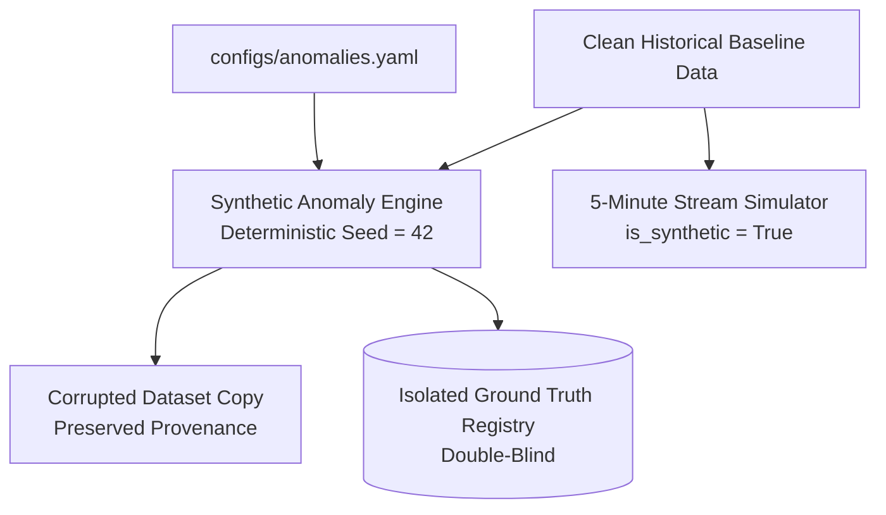

# SkyGuard AI — Synthetic Anomaly & Simulation Engine (Phase 2)

## 1. Overview
Because real-world AWS hardware failures and telemetry dropouts are sparse and unreliably labeled, SkyGuard AI provides a **controlled synthetic anomaly generation and simulation framework**.



---

## 2. The 15 Operational Anomaly Categories

| # | Anomaly Category | Mechanism | Affected Variables | Evaluation Objective |
|---|---|---|---|---|
| 1 | `SPIKE` | Impulse delta $+5^{\circ}\text{C}$ to $+20^{\circ}\text{C}$ over 1–3 steps | $T, RH, P$ | Impulse recall without false positives on adjacent steps |
| 2 | `SMALL_SPIKE` | Subtle impulse $+0.5^{\circ}\text{C}$ to $+2.0^{\circ}\text{C}$ | $T, RH, P$ | Sensitivity of statistical residual and Z-score filters |
| 3 | `NEGATIVE_SPIKE` | Large negative impulse ($-5^{\circ}\text{C}$ to $-20^{\circ}\text{C}$) | $T, RH, P$ | Negative transient detection |
| 4 | `DRIFT` | Monotonic linear slope ($0.1^{\circ}\text{C}$ to $1.0^{\circ}\text{C}$/hr) over 6–48h | $T, RH, P$ | Early detection latency before catastrophic drift |
| 5 | `OFFSET` | Step function baseline jump ($+2.0^{\circ}\text{C}$ to $+8.0^{\circ}\text{C}$) sustained | $T, RH, P$ | Persistent offset and recalibration alerting |
| 6 | `FROZEN_SENSOR` | Invariant static value held constant for 6–48 steps | $T, RH, P$ | Flatline detection during diurnal cycle |
| 7 | `INTERMITTENT_FREEZE`| Alternating slices of valid readings and frozen slices | $T, RH, P$ | Fragmented intermittent sensor detection |
| 8 | `MISSING_DATA` | Record deletions (single or burst) on dataset copies | All | Timely gap detection and imputation triggers |
| 9 | `COMMUNICATION_GAP`| Multi-hour sustained network outage dropping telemetry | All | Outage duration monitoring |
| 10 | `DUPLICATE_DATA` | Duplicate timestamp packets inserted | All | Ingestion deduplication verification |
| 11 | `OUT_OF_ORDER_DATA`| Swapped/permuted observation rows | Timestamp | Chronological watermark handling |
| 12 | `RANDOM_NOISE` | High-frequency Gaussian noise added ($\sigma = 1.5 - 5.0$) | $T, RH, P$ | Signal-to-noise degradation detection |
| 13 | `MULTIVARIATE_INCONSISTENCY` | Artificially diverging joint physical relationships | $T \times RH$ | Multi-variable physics consistency rules |
| 14 | `MULTI_SENSOR_FAULT` | Simultaneous independent faults across 2+ sensors | $T + RH$ | Compound multi-sensor diagnostics |
| 15 | `COMBINED_FAULT` | Sequential multi-stage failure (Spike $\to$ Gap $\to$ Offset)| Multi | Pipeline robustness against cascading faults |

---

## 3. Evaluation Reference Scenarios (Non-Faults)

### 3.1. `POSSIBLE_GENUINE_EVENT`
Simulates a genuine severe convective gust front or squall line:
- **Temperature**: Drops sharply ($-4.0^{\circ}\text{C}$ to $-8.0^{\circ}\text{C}$)
- **Pressure**: Jumps simultaneously ($+2.0\text{ hPa}$ to $+5.0\text{ hPa}$)
- **Humidity**: Rises ($+15\%$ to $+30\%$)
- **Ground Truth**: `ground_truth_label = 0`, `is_fault = False`.
- **Purpose**: Validates that extreme rates of change corroborated across multiple variables and spatial neighbors are **NOT** misclassified as hardware sensor failures (False Positive Rate check).

### 3.2. `UNCERTAIN`
Simulates borderline ambiguous anomalies ($1.2\sigma - 2.5\sigma$) to evaluate classification confidence calibration.

---

## 4. Ground Truth Schema & Isolation

Every injected anomaly generates an immutable `GroundTruthRecord` exported to `data/experiments/injected/<exp_id>_ground_truth.csv`:

```
timestamp,station_id,anomaly_id,anomaly_type,affected_variable,original_value,modified_value,injection_start,injection_end,severity_parameter,ground_truth_label,is_fault,metadata
2024-01-01T01:00:00Z,42182099999,ANOM-000001,SPIKE,temperature_c,28.4,40.0,2024-01-01T01:00:00Z,2024-01-01T01:05:00Z,11.6,1,True,"{""burst_length"": 1}"
```

> [!CAUTION]
> Ground-truth labels are strictly isolated from the feature matrix and are only accessed by evaluation scoring scripts during double-blind benchmarking.

---

## 5. 5-Minute Stream Simulator
- Re-samples lower-cadence or irregular historical series onto a regular 5-minute grid using time-aware interpolation with optional micro-turbulence.
- Every simulated observation is explicitly tagged:
  - `is_synthetic = True`
  - `source_resolution_minutes = <native_cadence>`
  - `simulation_resolution_minutes = 5.0`
  - `simulation_method = "time_spline"`
- **Strict Rule**: Interpolation is used purely for temporal pipeline testing, **never** to fabricate observational truth.
