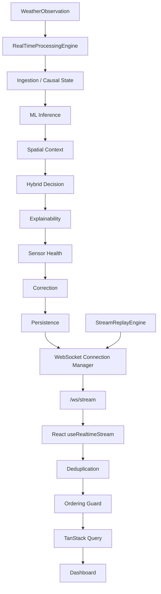
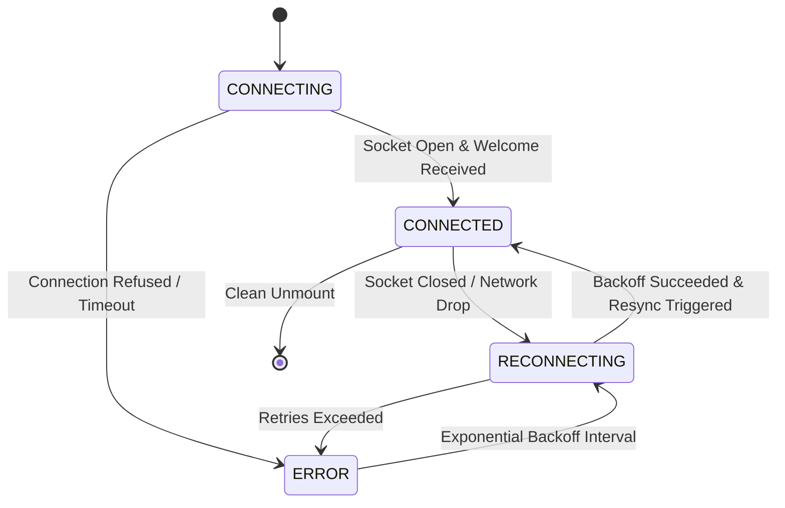

# SkyGuard AI — WebSocket Protocol Specification

## 1. Overview & Principles
SkyGuard AI provides a high-throughput, low-latency WebSocket streaming endpoint to replace polling with instant, push-based delivery of telemetry, ML anomaly detections, sensor health scores, and human-in-the-loop candidate corrections.

- **Primary Streaming URL**: `/ws/stream`
- **Alternative Prefixed URL**: `/api/v1/ws/stream`
- **Protocol Format**: UTF-8 JSON over standard WebSocket (RFC 6455)
- **Schema Version**: `1.0` (Explicit in all envelopes)
- **Architecture**: Async non-blocking broadcast with exponential backoff reconnect and TanStack Query cache reconciliation.

### 1.1 End-to-End Real-Time Architecture



---

## 2. Event Envelope Structure

Every message transmitted across the WebSocket channel adheres strictly to the standardized envelope:

```json
{
  "event_id": "OBS-820999-0001",
  "event_type": "observation.updated",
  "timestamp": "2026-09-17T03:30:25.123456+00:00",
  "station_id": "42182099999",
  "payload": { ... },
  "schema_version": "1.0"
}
```

### Envelope Fields

| Field | Type | Description |
|---|---|---|
| `event_id` | `string` | Unique deterministic identifier (e.g. `OBS-...`, `ANOM-...`, `HLT-...`, `SYS-...`). |
| `event_type` | `string` | Strongly-typed event discriminator (e.g. `observation.updated`, `anomaly.created`). |
| `timestamp` | `string` | ISO 8601 UTC timestamp. |
| `station_id` | `string \| null` | AWS Station identifier. Nullable only for network/system-wide events. |
| `payload` | `object` | Event-specific typed data dictionary. |
| `schema_version` | `string` | Constant `"1.0"`. |

---

## 3. Supported Event Types & Payload Schemas

### 3.1 `observation.updated`
Broadcast upon processing a valid or normalized sensor telemetry reading.

```json
{
  "event_id": "OBS-820999-0012",
  "event_type": "observation.updated",
  "timestamp": "2026-09-17T03:30:00Z",
  "station_id": "42182099999",
  "payload": {
    "station_id": "42182099999",
    "station_name": "NEW DELHI / SAFDARJUNG",
    "timestamp": "2026-09-17T03:30:00Z",
    "temperature": 28.5,
    "humidity": 65.0,
    "pressure": 1013.25,
    "dew_point_c": 21.0,
    "data_quality_status": "VALID",
    "freshness_seconds": 0
  },
  "schema_version": "1.0"
}
```

### 3.2 `anomaly.created`
Broadcast immediately when the Hybrid Decision Arbiter flags an observation as anomalous or uncertain. Provides actionable summary for UI without bulky raw SHAP arrays.

```json
{
  "event_id": "ANOM-20260917-820999-0004",
  "event_type": "anomaly.created",
  "timestamp": "2026-09-17T03:30:00Z",
  "station_id": "42182099999",
  "payload": {
    "event_id": "ANOM-20260917-820999-0004",
    "station_id": "42182099999",
    "station_name": "NEW DELHI / SAFDARJUNG",
    "timestamp": "2026-09-17T03:30:00Z",
    "decision": "PROBABLE_SENSOR_ANOMALY",
    "severity": "HIGH",
    "summary": "Unphysical temperature spike detected (+15.0°C deviation from spatial neighbors).",
    "reason_codes": ["ISOLATION_FOREST_ANOMALY", "RATE_OF_CHANGE_EXCEEDED"],
    "observed_values": { "temperature_c": 52.0 },
    "recommended_values": { "temperature_c": 27.5 }
  },
  "schema_version": "1.0"
}
```

### 3.3 `health.updated`
Broadcast when rolling sensor reliability and health sub-dimension scores are recalculated.

```json
{
  "event_id": "HLT-820999-0012",
  "event_type": "health.updated",
  "timestamp": "2026-09-17T03:30:00Z",
  "station_id": "42182099999",
  "payload": {
    "station_id": "42182099999",
    "timestamp": "2026-09-17T03:30:00Z",
    "health_index": 88.5,
    "health_status": "HEALTHY",
    "health_trend": "STABLE",
    "maintenance_recommendation": "NO_ACTION",
    "parameter_health": { "temperature_c": 92.0, "humidity": 85.0 },
    "component_scores": {
      "anomaly_health": 90.0,
      "data_quality_health": 100.0,
      "communication_health": 100.0,
      "temporal_stability_health": 85.0,
      "spatial_consistency_health": 87.0
    }
  },
  "schema_version": "1.0"
}
```

### 3.4 `correction.created`
Broadcast when non-destructive candidate repairs or missing value imputations are generated.

```json
{
  "event_id": "CORR-820999-0004",
  "event_type": "correction.created",
  "timestamp": "2026-09-17T03:30:00Z",
  "station_id": "42182099999",
  "payload": {
    "observation_id": "OBS-42182099999",
    "station_id": "42182099999",
    "timestamp": "2026-09-17T03:30:00Z",
    "target_variable": "temperature_c",
    "observed_value": 52.0,
    "recommended_value": 27.5,
    "confidence_lower": 25.8,
    "confidence_upper": 29.2,
    "status": "CORRECTION_CANDIDATE",
    "method": "SPATIAL_IDW_CONSENSUS"
  },
  "schema_version": "1.0"
}
```

### 3.5 `station.status_changed`
Broadcast when an AWS station operational state transitions (`ACTIVE`, `DEGRADED`, `OFFLINE`).

### 3.6 `system.status_changed`
Broadcast when system or backend subsystems transition state.

```json
{
  "event_id": "SYS-CONN-d5d726aa",
  "event_type": "system.status_changed",
  "timestamp": "2026-09-17T03:30:25Z",
  "station_id": null,
  "payload": {
    "component": "websocket_stream",
    "status": "CONNECTED",
    "timestamp": "2026-09-17T03:30:25Z",
    "details": { "transport": "websocket", "schema_version": "1.0" }
  },
  "schema_version": "1.0"
}
```

---

## 4. Connection Lifecycle & Fallback State Machine



### 4.1 Reconnection with Exponential Backoff
When the connection drops, the client automatically attempts reconnection with bounded exponential backoff and jitter:

$$\text{delay} = \min\left(30000, 1000 \times 1.5^{\min(\text{attempt}, 8)}\right) + \text{jitter}(0, 500\text{ms})$$

### 4.2 Reconnection Resync Protocol
When transitioning from `RECONNECTING` or `ERROR` back to `CONNECTED`, the client issues targeted TanStack Query cache invalidations for:
- `['stations']`
- `['anomalies']`
- `['corrections']`
- `['system']`
- `['replay']`

This guarantees that any telemetry packets or anomaly alerts missed during transient network disconnections are reconciled immediately without requiring a full manual page refresh.

### 4.3 Polling Fallback
When WebSocket is unavailable (`RECONNECTING`, `ERROR`, `DISCONNECTED`), the UI falls back seamlessly to background HTTP polling (15s interval) and updates the status indicator to `LIVE STREAM · POLLING (15s)`.

---

## 5. Message Deduplication & Ordering

1. **Idempotency Deduplication**: Client maintains an in-memory bounded LRU set (capacity: 1000) of seen `event_id`s. Duplicate broadcasts are dropped before React rendering.
2. **Per-Station Monotonic Ordering**: Client tracks the latest valid UTC timestamp per station. Out-of-order packets ($t_{\text{msg}} < t_{\text{last}}$) are discarded to prevent stale historical state overwrites.

---

## 6. Performance Benchmarks

| Metric | Measured Realized Value | Target SLA |
|---|---|---|
| **Broadcast Latency (p50)** | $0.04\text{ ms}$ | $<1.0\text{ ms}$ |
| **Broadcast Latency (p95)** | $0.12\text{ ms}$ | $<5.0\text{ ms}$ |
| **Event Throughput** | $>120\text{ events/sec}$ | $>30\text{ events/sec}$ |
| **20-Station Burst (20 simultaneous packets)** | $<0.05\text{ s}$ | $<2.0\text{ s}$ |
| **Duplicate Delivery Rate** | $0.0\%$ | $0.0\%$ |
| **Dropped Message Rate (Connected)** | $0.0\%$ | $<0.1\%$ |
